# Le backend de Guitar Practice Cloud — guide de compréhension

Ce document explique le dossier `backend/` : son architecture, ses technologies,
ses workflows et la gestion de l'authentification. Chaque notion commence par
une définition courte (**C'est quoi ?**), puis l'explication appliquée au projet.
La dernière partie liste les améliorations possibles et leurs raisons.

Les schémas sont au format Mermaid : ils s'affichent sur GitHub, GitLab et dans
VS Code (extension « Markdown Preview Mermaid Support »). On peut aussi coller un
bloc sur https://mermaid.live pour l'exporter en image.

## Sommaire

1. [Vue d'ensemble](#1-vue-densemble)
2. [Technologies et modules](#2-technologies-et-modules)
3. [Architecture du code](#3-architecture-du-code)
4. [Le démarrage du serveur](#4-le-démarrage-du-serveur)
5. [Le pipeline des middlewares](#5-le-pipeline-des-middlewares)
6. [Les routes de l'API](#6-les-routes-de-lapi)
7. [Les données : MongoDB et Mongoose](#7-les-données--mongodb-et-mongoose)
8. [L'authentification](#8-lauthentification)
9. [Les workflows, requête par requête](#9-les-workflows-requête-par-requête)
10. [La gestion des erreurs](#10-la-gestion-des-erreurs)
11. [Les logs](#11-les-logs)
12. [La configuration et les secrets](#12-la-configuration-et-les-secrets)
13. [Les tests](#13-les-tests)
14. [Améliorations possibles et pourquoi](#14-améliorations-possibles-et-pourquoi)

---

## 1. Vue d'ensemble

> **C'est quoi un backend ?** La partie d'une application qui tourne sur un
> serveur, invisible pour l'utilisateur : elle reçoit les requêtes, applique les
> règles métier et de sécurité, et stocke les données.

> **C'est quoi une API ?** (*Application Programming Interface*) Un ensemble
> d'adresses (URL) qu'un autre programme peut appeler pour demander ou envoyer
> des données. Ici, le frontend Angular appelle l'API du backend.

Le backend de Guitar Practice Cloud est une **API REST** écrite en JavaScript
avec **Node.js** et **Express**. Il gère les comptes utilisateurs et une
bibliothèque de fichiers audio. Il a deux lieux de stockage :

- **MongoDB Atlas** (dans le cloud) pour les utilisateurs et les *métadonnées* des pistes (titre, taille, propriétaire…) ;
- **le disque du serveur** (`backend/data/uploads/`) pour les *octets* des fichiers audio.

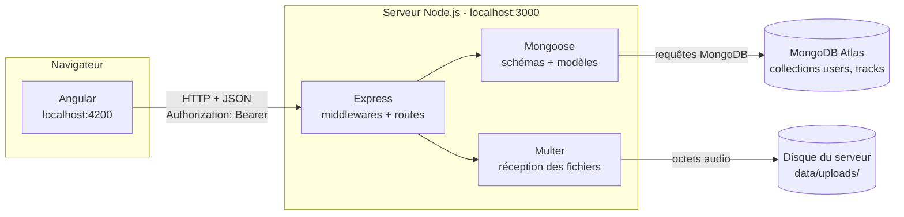

Règle fondamentale : **Angular ne parle jamais à MongoDB**. Le navigateur n'est
pas un lieu sûr (tout son code est visible et modifiable par l'utilisateur), donc
l'accès à la base et le secret JWT restent exclusivement dans le backend.

---

## 2. Technologies et modules

> **C'est quoi un module (ou paquet, ou dépendance) ?** Un morceau de code
> réutilisable publié par d'autres développeurs, qu'on installe avec `npm`
> plutôt que de le réécrire. La liste des modules du projet est dans
> `backend/package.json`.

### Le socle

| Technologie | C'est quoi ? | Rôle dans le projet |
|---|---|---|
| **Node.js** (v22+) | Un programme qui exécute du JavaScript en dehors du navigateur, avec accès aux fichiers et au réseau. | Fait tourner tout le backend. |
| **npm** | Le gestionnaire de paquets de Node. | Installe les modules (`npm install`), lance les scripts (`npm start`, `npm test`). |
| **ES Modules** | La syntaxe moderne `import` / `export` de JavaScript. | Activée par `"type": "module"` dans `package.json`. |
| **MongoDB Atlas** | Une base de données MongoDB hébergée dans le cloud par l'éditeur. | Stocke les documents `users` et `tracks`. |

### Les modules installés

| Module | Version installée | C'est quoi ? | Utilisé où |
|---|---|---|---|
| **express** | 5.2 | Un framework de serveur web : associe des URL à des fonctions et enchaîne des middlewares. | tout `app.js` |
| **mongoose** | 9.9 | Un ODM (*Object Document Mapper*) : une couche entre le code et MongoDB qui ajoute schémas, validation et méthodes. | `server.js`, `models/` |
| **jsonwebtoken** | 9.0 | Fabrique (`sign`) et vérifie (`verify`) les JSON Web Tokens. | `token()` et `auth()` dans `app.js` |
| **bcryptjs** | 3.0 | Hache les mots de passe et compare un mot de passe à un hash. | `models/User.js` |
| **multer** | 2.3 | Un middleware qui décode les envois de fichiers (`multipart/form-data`) et les écrit sur le disque. | route `POST /api/tracks` |
| **cors** | 2.8 | Un middleware qui autorise le navigateur à appeler l'API depuis une autre origine (autre port ou domaine). | `app.use(cors())` |

Modules intégrés à Node (pas besoin de les installer) : `node:fs` et
`node:fs/promises` (fichiers), `node:path` (chemins), `node:crypto` (UUID
aléatoires), `node:test` et `node:assert` (tests).

Il n'y a pas de module `dotenv` : Node ≥ 20.6 lit lui-même le fichier `.env`
grâce à l'option `--env-file=.env` du script `npm start`.

---

## 3. Architecture du code

> **C'est quoi l'architecture d'un logiciel ?** La façon dont le code est
> découpé en parties, ce que fait chaque partie, et comment elles communiquent.

### Arborescence

```text
backend/
├── package.json          dépendances et scripts (start, test)
├── .env                  secrets locaux — jamais dans Git
├── .gitignore            exclut .env, node_modules/ et les fichiers uploadés
├── data/uploads/         fichiers audio reçus, renommés en UUID
├── src/
│   ├── server.js         point d'entrée : config, connexion MongoDB, compte démo, ouverture du port
│   ├── app.js            l'application Express : middlewares, routes, gestion d'erreurs
│   └── models/
│       ├── User.js       schéma et méthodes des utilisateurs
│       └── Track.js      schéma et méthodes des pistes audio
└── test/
    └── api.test.js       tests automatisés
```

### Le découpage en couches

> **C'est quoi une couche ?** Un niveau du programme qui a une seule
> responsabilité et ne parle qu'aux niveaux voisins.

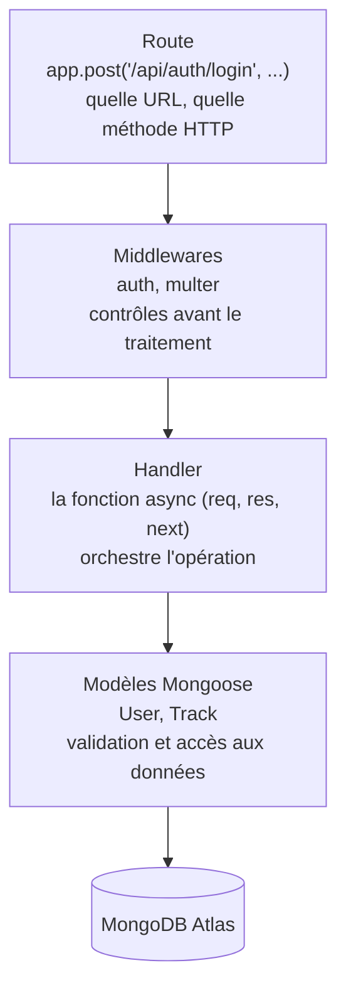

### Pourquoi `server.js` et `app.js` sont séparés

`app.js` exporte une fonction `createApp()` qui **construit** l'application
Express sans ouvrir de port ni se connecter à la base. `server.js` fait le reste.

Intérêt : les tests peuvent créer la même application sur un port aléatoire
(`listen(0)`), sans MongoDB, sans occuper le port 3000. C'est ce que fait
`test/api.test.js`.

À noter : dans ce projet, toutes les routes sont écrites directement dans
`app.js` (environ 460 lignes). C'est simple à lire pour un TP, mais cela ne
passe pas à l'échelle ; voir l'[amélioration n°15](#14-améliorations-possibles-et-pourquoi).

---

## 4. Le démarrage du serveur

> **C'est quoi le démarrage (ou *bootstrap*) ?** La séquence d'actions
> exécutée une seule fois au lancement, avant que le serveur accepte la
> première requête.

`npm start` exécute `node --env-file=.env src/server.js` :

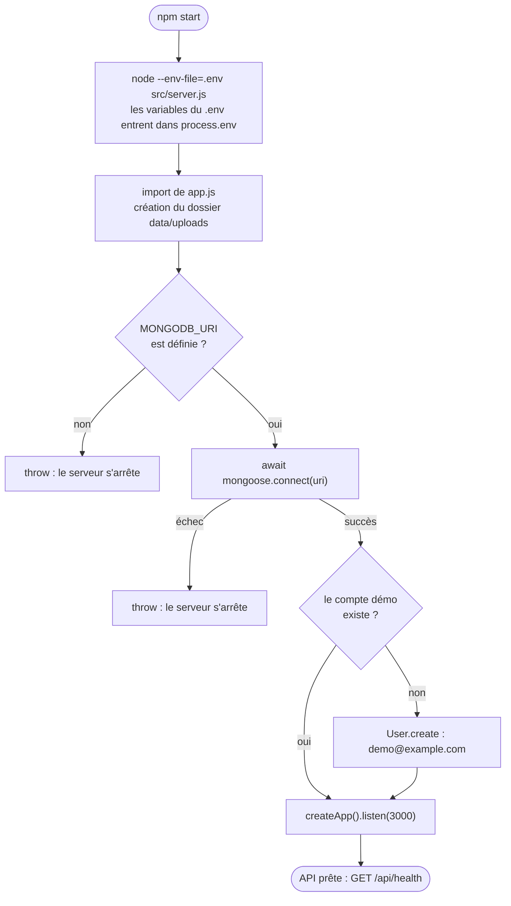

Trois choix importants :

- **Échouer tôt** : sans URI MongoDB ou sans connexion, le serveur refuse de démarrer plutôt que d'accepter des requêtes qu'il ne pourrait pas traiter.
- **Attendre la base avant d'ouvrir le port** : `await mongoose.connect()` passe avant `listen()`.
- **Le dossier d'uploads est relatif au répertoire courant** : `path.resolve("data/uploads")` part du dossier où l'on lance la commande. C'est pourquoi il faut lancer `npm start` depuis `backend/`.

---

## 5. Le pipeline des middlewares

> **C'est quoi un middleware ?** Une fonction `(req, res, next)` placée sur le
> trajet d'une requête. Elle peut lire ou modifier la requête, la laisser passer
> en appelant `next()`, ou l'arrêter en envoyant elle-même une réponse.

Une requête traverse les middlewares **dans l'ordre où ils sont déclarés** :

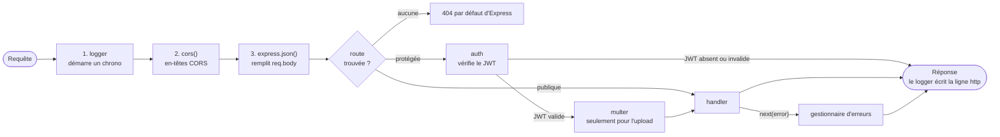

| Middleware | Ligne | Rôle |
|---|---|---|
| logger maison | `app.js:132` | Au moment où la réponse part (`res.on("finish")`), écrit `[http] METHODE URL -> statut (durée)`. N'écrit jamais le corps de la requête, qui peut contenir un mot de passe. |
| `cors()` | `app.js:145` | Ajoute les en-têtes qui autorisent les appels depuis une autre origine. |
| `express.json()` | `app.js:150` | Transforme le texte JSON reçu en objet JavaScript dans `req.body`. Sans lui, `req.body` serait `undefined`. |
| `auth` | `app.js:56` | Placé uniquement sur les routes protégées. Voir [section 8](#8-lauthentification). |
| `upload.single("audio")` | `app.js:337` | Multer, uniquement sur `POST /api/tracks`. |
| gestionnaire d'erreurs | `app.js:442` | Reconnaissable à ses **4 paramètres** `(error, req, res, next)`. Voir [section 10](#10-la-gestion-des-erreurs). |

**Pourquoi l'ordre compte** : sur `POST /api/tracks`, `auth` est placé **avant**
`multer`. Un visiteur non connecté est donc rejeté avant que le moindre octet ne
soit écrit sur le disque.

---

## 6. Les routes de l'API

> **C'est quoi une route (ou *endpoint*) ?** L'association d'une méthode HTTP et
> d'une URL à une fonction du serveur. Exemple : `GET /api/users/me` → « renvoie
> le profil de l'utilisateur connecté ».

> **C'est quoi un handler ?** La fonction qui traite la requête une fois
> arrivée à destination et envoie la réponse, **une seule fois**.

> **C'est quoi REST ?** Une convention : les URL désignent des ressources
> (`/users`, `/tracks`) et la méthode HTTP indique l'action (`GET` lire,
> `POST` créer, `PUT` modifier, `DELETE` supprimer).

Toutes les routes sont décrites dans `API_CONTRACT.md` à la racine du dépôt.

| Méthode | URL | Auth | Réponse | Erreurs | Ligne |
|---|---|---|---|---|---|
| GET | `/api/health` | publique | `200 {status:"ok"}` | — | `app.js:153` |
| POST | `/api/auth/register` | publique | `201 {token, user}` | `400`, `409` | `app.js:164` |
| POST | `/api/auth/login` | publique | `200 {token, user}` | `401` | `app.js:195` |
| GET | `/api/users/me` | JWT | `200 User` | `401`, `404` | `app.js:229` |
| PUT | `/api/users/me` | JWT | `200 User` | `400`, `401`, `404` | `app.js:249` |
| GET | `/api/tracks?page=&limit=` | JWT | `200 Page<Track>` | `401` | `app.js:271` |
| POST | `/api/tracks` | JWT | `201 Track` | `400`, `401` | `app.js:334` |
| GET | `/api/tracks/:id/audio` | JWT | flux audio | `401`, `404` | `app.js:379` |
| DELETE | `/api/tracks/:id` | JWT | `204` | `401`, `404`, `500` | `app.js:409` |

> **C'est quoi un code de statut HTTP ?** Un nombre à 3 chiffres qui résume le
> résultat : `2xx` succès, `4xx` erreur du client (données invalides, pas
> connecté…), `5xx` erreur du serveur.

| Code | Sens | Exemple dans ce backend |
|---|---|---|
| `200` OK | succès | login réussi, lecture du profil |
| `201` Created | ressource créée | inscription, upload |
| `204` No Content | succès sans corps | suppression d'une piste |
| `400` Bad Request | données invalides | mot de passe de moins de 8 caractères, mauvais format audio |
| `401` Unauthorized | pas authentifié | pas de JWT, JWT expiré, mot de passe faux |
| `404` Not Found | ressource introuvable | piste inexistante ou appartenant à un autre |
| `409` Conflict | conflit avec l'existant | email déjà utilisé |
| `500` Internal Server Error | bug ou panne côté serveur | erreur non prévue |

---

## 7. Les données : MongoDB et Mongoose

> **C'est quoi MongoDB ?** Une base de données **NoSQL orientée documents** :
> au lieu de tables et de lignes, elle range des **documents** (des objets
> proches du JSON) dans des **collections**.

> **C'est quoi Mongoose ?** Une bibliothèque qui se place entre Node.js et
> MongoDB. MongoDB accepterait n'importe quel document ; Mongoose impose une
> forme (schéma), valide les données et offre des méthodes pratiques
> (`findById`, `create`…).

> **C'est quoi un schéma ?** La description de la forme attendue d'un document :
> ses champs, leurs types et leurs règles (obligatoire, unique, longueur…).

> **C'est quoi un modèle ?** La classe générée à partir d'un schéma, qui sert à
> lire et écrire dans une collection. `User` écrit dans la collection `users`.

### Le modèle de données

> **C'est quoi un ObjectId ?** L'identifiant unique que MongoDB génère pour
> chaque document, dans le champ `_id`.

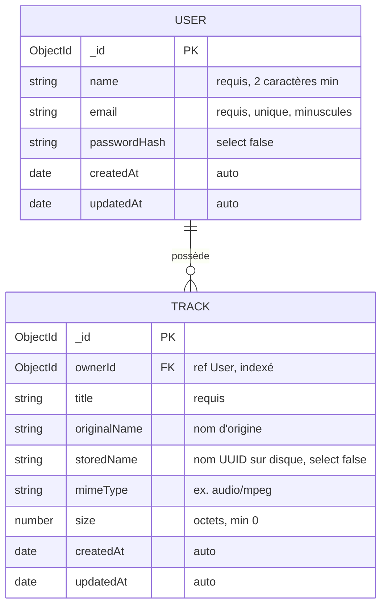

Un utilisateur possède zéro, une ou plusieurs pistes. La relation est faite par
**référence** : chaque piste stocke l'`_id` de son propriétaire dans `ownerId`.

### Les fonctionnalités Mongoose utilisées

| Fonctionnalité | C'est quoi ? | Dans le projet |
|---|---|---|
| **Validation** | Des règles vérifiées avant l'écriture. | `required`, `minlength: 2`, `unique`, `min: 0` |
| **Transformation** | Des modifications automatiques des valeurs. | `lowercase` et `trim` sur l'email |
| **`timestamps`** | Ajout automatique des dates de création et de modification. | `createdAt`, `updatedAt` sur les deux modèles |
| **`select: false`** | Un champ jamais renvoyé par défaut dans les lectures. | `passwordHash`, `storedName`. Pour le lire, il faut le demander : `.select("+passwordHash")`. |
| **Champ virtuel** | Un champ utilisable dans le code mais jamais enregistré en base. | `password` : le setter garde le mot de passe en mémoire le temps de le hacher. |
| **Hook** | Une fonction exécutée automatiquement à un moment précis du cycle de vie. | `pre("validate")` hache le mot de passe avant l'enregistrement. |
| **Méthodes d'instance** | Des fonctions ajoutées à chaque document. | `verifyPassword()`, `toPublic()` |
| **Référence** | Un champ qui pointe vers un document d'une autre collection. | `ownerId: { ref: "User" }` |
| **Index** | Une structure qui accélère une recherche fréquente, au prix d'écritures un peu plus lentes. | `{ ownerId: 1, createdAt: -1 }` : « mes pistes, les plus récentes d'abord » |
| **`.lean()`** | Renvoie des objets JavaScript simples au lieu de documents Mongoose, plus rapides. | liste des pistes |

### `toPublic()` : ce qui a le droit de sortir

Chaque modèle définit `toPublic()`, qui construit l'objet renvoyé au client en
choisissant les champs **un par un**. Le hash du mot de passe et le nom de
fichier interne n'y figurent pas : ils ne peuvent pas fuiter par erreur dans une
réponse JSON.

---

## 8. L'authentification

> **C'est quoi l'authentification ?** Prouver *qui* on est (« je suis Demo »).

> **C'est quoi l'autorisation ?** Décider *ce qu'on a le droit de faire* une fois
> identifié (« Demo peut lire ses pistes, pas celles des autres »).

Le backend fait les deux : le middleware `auth` **authentifie**, le filtre
`ownerId: req.auth.sub` sur les pistes **autorise**.

### 8.1 Le hachage des mots de passe

> **C'est quoi un hash ?** Le résultat d'un calcul à sens unique : facile à
> produire à partir du mot de passe, impossible à inverser pour le retrouver.

> **C'est quoi bcrypt ?** Un algorithme de hachage conçu pour les mots de passe :
> volontairement lent et « salé ».

> **C'est quoi un sel (*salt*) ?** Une valeur aléatoire ajoutée au mot de passe
> avant le hachage. Deux utilisateurs ayant le même mot de passe obtiennent ainsi
> deux hashs différents.

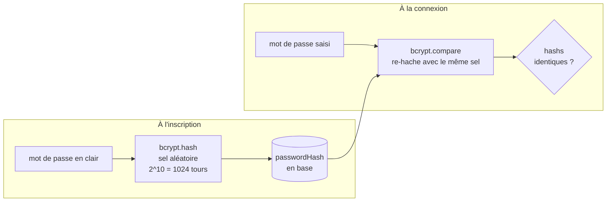

Un hash stocké ressemble à `$2b$10$` suivi de 53 caractères (60 au total) :
`2b` est la version de bcrypt, `10` le coût, puis viennent le sel et le hash.
Le sel est **dans** le hash : c'est ce qui permet à `bcrypt.compare` de refaire
le même calcul.

Pourquoi c'est important : si la base fuite, l'attaquant n'obtient que des hashs.
Pour retrouver un mot de passe, il doit essayer des candidats un par un, et
chaque essai coûte environ 100 ms à cause des 1024 tours.

Où c'est codé : le hook `pre("validate")` et la méthode `verifyPassword()` de
`models/User.js`. Mettre le hachage dans le **modèle** plutôt que dans la route
garantit qu'aucun utilisateur ne peut être créé avec un mot de passe en clair,
quelle que soit la route qui le crée.

### 8.2 Le JSON Web Token (JWT)

> **C'est quoi un JWT ?** Un texte signé que le serveur remet au client après la
> connexion. Le client le renvoie à chaque requête pour prouver son identité,
> comme un bracelet de festival.

> **C'est quoi une signature ?** Une empreinte calculée à partir du contenu et
> d'une clé secrète. Si le contenu change d'un seul caractère, la signature ne
> correspond plus.

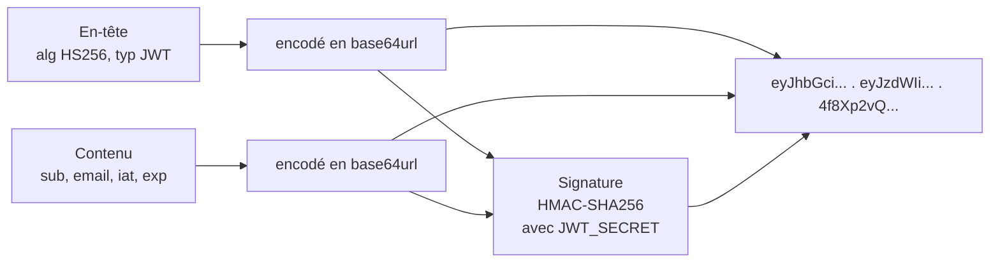

Contenu d'un token émis par ce backend :

```json
{
  "sub": "65f1c2a9e4b0...",
  "email": "demo@example.com",
  "iat": 1790000000,
  "exp": 1790007200
}
```

| Champ | Sens |
|---|---|
| `sub` | *subject* : l'`_id` MongoDB de l'utilisateur |
| `email` | l'email, pour information |
| `iat` | *issued at* : date d'émission (ajoutée automatiquement) |
| `exp` | *expiration* : `iat` + 7200 secondes, soit 2 heures (`expiresIn: "2h"`) |

⚠️ **Un JWT est signé, pas chiffré.** Le contenu est lisible par n'importe qui
(il suffit de décoder le base64). On n'y met donc jamais d'information secrète.
Ce qui empêche la falsification, c'est la signature : sans `JWT_SECRET`,
impossible de fabriquer un token valide.

**Sans état (*stateless*)** : le serveur ne garde aucune liste des sessions
ouvertes. Vérifier la signature lui suffit pour savoir qui parle.
Conséquence : une « déconnexion » ne fait qu'effacer le token côté client ; le
token lui-même reste valide jusqu'à son expiration.

### 8.3 Le middleware `auth`, étape par étape

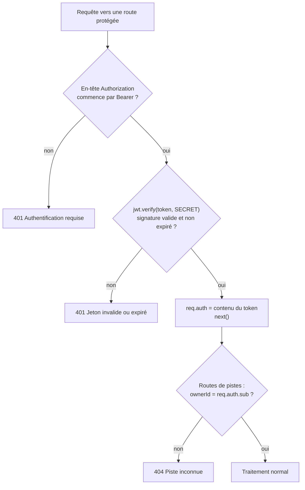

Points clés :

- l'identité vient **toujours** du token (`req.auth.sub`), jamais du corps de la requête : un utilisateur ne peut pas se faire passer pour un autre en envoyant un autre id ;
- les deux cas de `401` ont des messages différents, ce qui aide au débogage ;
- une piste qui appartient à un autre utilisateur renvoie `404` et non `403` : le serveur ne révèle même pas qu'elle existe ;
- la valeur du token n'est jamais écrite dans les logs.

---

## 9. Les workflows, requête par requête

> **C'est quoi un workflow ?** L'enchaînement ordonné des étapes que suit une
> opération, du début à la fin, en passant par les différents composants
> (ici : navigateur, middlewares, handler, base de données, disque).

### 9.1 Inscription — `POST /api/auth/register`

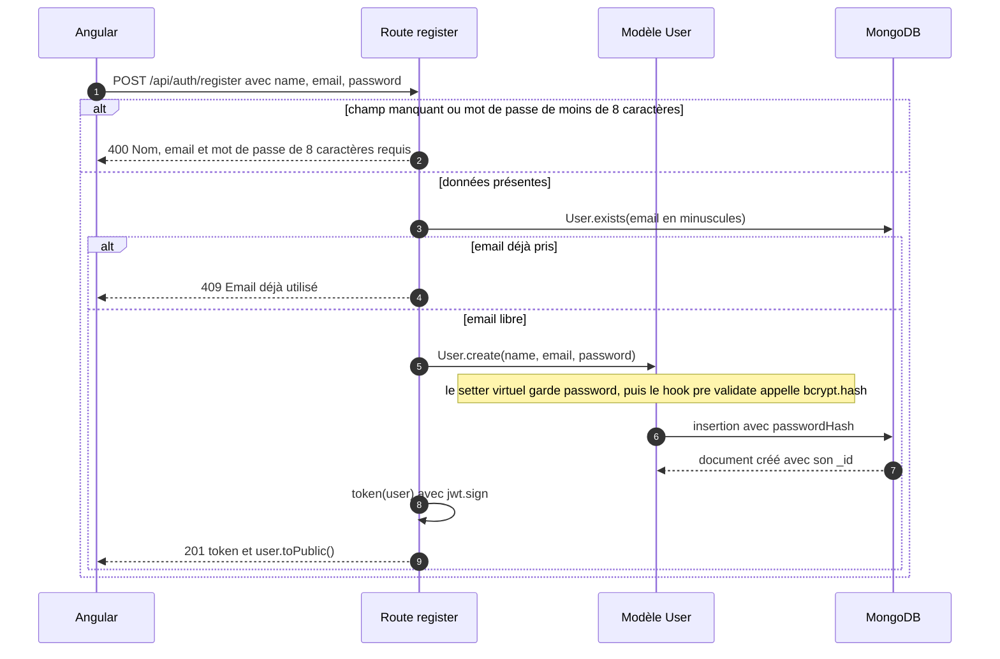

L'utilisateur est connecté dès l'inscription : la réponse contient déjà un token.

### 9.2 Connexion — `POST /api/auth/login`

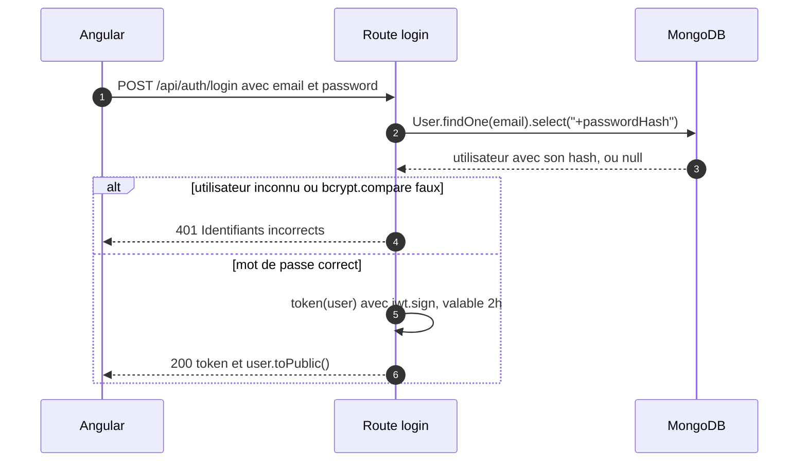

Le message est **le même** pour un email inconnu et pour un mot de passe faux :
un attaquant ne peut pas savoir lequel des deux était erroné.

### 9.3 Lecture et modification du profil — `GET` et `PUT /api/users/me`

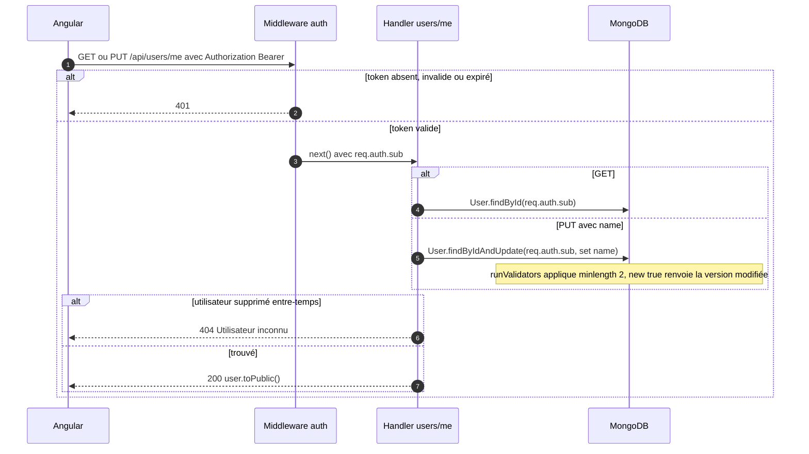

Le `PUT` ne modifie **que** le nom (`$set: { name }`) : même si le client envoie
un email ou un mot de passe dans le corps, ils sont ignorés.

### 9.4 Upload d'une piste — `POST /api/tracks`

> **C'est quoi `multipart/form-data` ?** Le format utilisé pour envoyer des
> fichiers en HTTP : le corps est découpé en plusieurs parties, ici un fichier
> (`audio`) et un champ texte (`title`). Ce n'est pas du JSON, d'où le besoin
> de Multer.

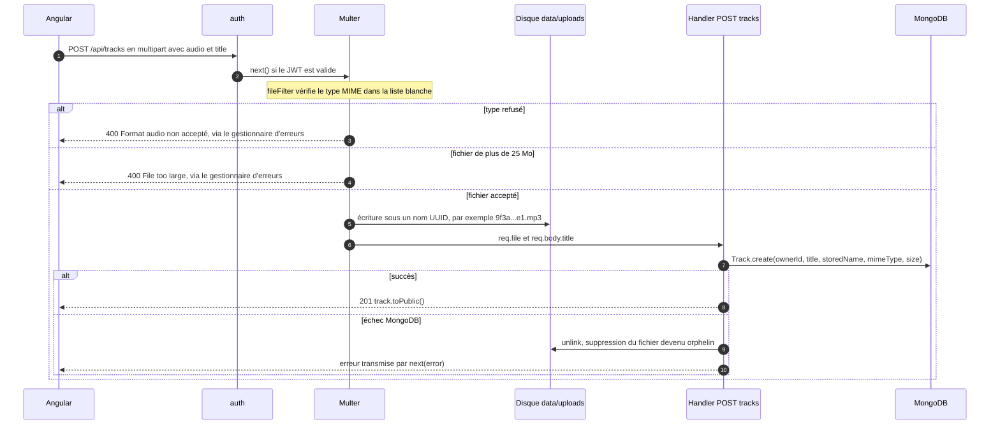

Les protections de l'upload :

| Protection | Pourquoi |
|---|---|
| `auth` avant Multer | rien n'est écrit sur le disque pour un visiteur anonyme |
| liste blanche de types MIME | refuse tout ce qui n'est pas MP3, WAV, OGG ou M4A |
| `limits.fileSize` à 25 Mo | évite qu'un fichier énorme remplisse le disque ; Multer coupe dès la limite atteinte |
| nom de stockage = UUID aléatoire | pas de collision entre deux fichiers de même nom, pas de nom dangereux comme `../../server.js` |
| nettoyage en cas d'échec | le disque et la base restent cohérents |

> **C'est quoi un type MIME ?** Une étiquette qui décrit la nature d'un fichier,
> par exemple `audio/mpeg` pour un MP3.

### 9.5 Liste paginée — `GET /api/tracks?page=2&limit=5`

> **C'est quoi la pagination ?** Découper une longue liste en pages de taille
> fixe pour ne transférer que ce qui est affiché.

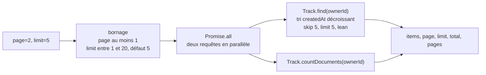

`Promise.all` lance la lecture et le comptage **en même temps** : le temps de
réponse est celui de la plus lente des deux, pas leur somme. Le handler
convertit aussi `_id` en `id` pour respecter le contrat.

### 9.6 Lecture audio — `GET /api/tracks/:id/audio`

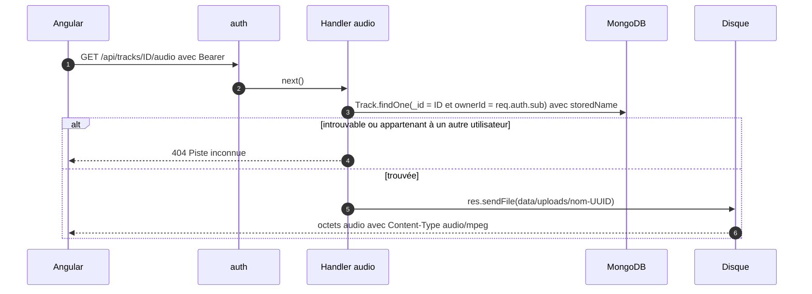

Le chemin du fichier est construit par le serveur à partir de la base, jamais à
partir de ce qu'envoie le client : impossible de demander un autre fichier du
disque.

### 9.7 Suppression — `DELETE /api/tracks/:id`

`findOneAndDelete({ _id, ownerId })` supprime la métadonnée, puis `unlink`
supprime le fichier. Si la suppression du fichier échoue, la réponse est un
`500` explicite (« Métadonnée supprimée, mais fichier audio non supprimé ») :
le problème est signalé plutôt que caché. Cette route est un bonus du contrat,
le frontend actuel ne l'appelle pas.

---

## 10. La gestion des erreurs

> **C'est quoi une gestion d'erreurs centralisée ?** Un seul endroit du code qui
> reçoit toutes les erreurs imprévues et les transforme en réponses HTTP
> cohérentes, au lieu de répéter ce traitement dans chaque route.

> **C'est quoi `try/catch` avec `async/await` ?** `await` attend le résultat d'une
> opération lente (base, disque) ; si elle échoue, une exception est levée.
> `try/catch` l'attrape pour la traiter au lieu de laisser le programme dans un
> état incertain.

Chaque handler suit le même modèle :

```js
app.get("/api/users/me", auth, async (req, res, next) => {
  try {
    // ... opérations avec await
  } catch (error) {
    console.error("[user] Erreur de lecture du profil", error); // trace côté serveur
    next(error);                                                // délègue la réponse
  }
});
```

Express 5 transmettrait de toute façon au gestionnaire d'erreurs une promesse
rejetée ; le `try/catch` explicite sert à **journaliser avec le contexte** de la
route avant de déléguer.

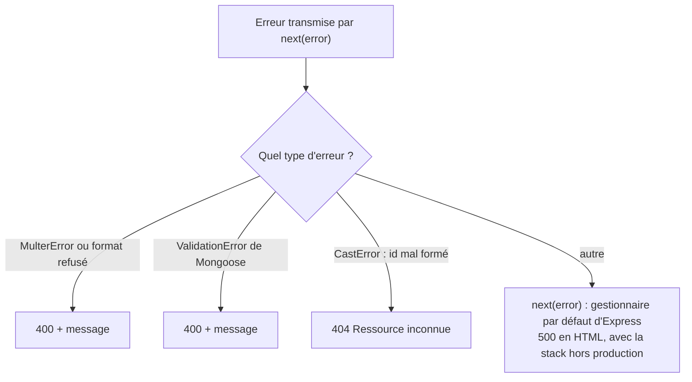

| Erreur | Exemple qui la déclenche | Réponse |
|---|---|---|
| `MulterError` | fichier de plus de 25 Mo | `400` |
| « Format audio non accepté » | envoi d'un PDF | `400` |
| `ValidationError` | `PUT /users/me` avec un nom d'une lettre | `400` |
| `CastError` | `GET /api/tracks/abc/audio` (`abc` n'est pas un ObjectId) | `404` |
| toute autre erreur | panne MongoDB, doublon d'email concurrent… | `500` généré par Express, en HTML (voir [améliorations](#14-améliorations-possibles-et-pourquoi)) |

---

## 11. Les logs

> **C'est quoi un log ?** Une ligne écrite par le programme pour garder la trace
> de ce qu'il fait. C'est le premier outil pour comprendre un bug.

Les logs apparaissent dans le **terminal** où tourne `npm start`. Chaque ligne a
un préfixe qui indique sa provenance :

| Préfixe | Origine |
|---|---|
| `[startup]` | démarrage : dossier d'uploads, connexion, compte démo |
| `[http]` | une ligne par requête : méthode, URL, statut, durée |
| `[auth]` | inscription, connexion, vérification des tokens |
| `[user]` | lecture et modification du profil |
| `[tracks]` | liste, upload, lecture, suppression |
| `[multer]` | réception et filtrage des fichiers |
| `[user-model]`, `[track-model]` | opérations des modèles |
| `[error]` | gestionnaire d'erreurs central |

Exemple d'une connexion réussie :

```text
[auth] Tentative de connexion pour demo@example.com
[user-model] Vérification du mot de passe pour demo@example.com
[auth] Connexion réussie : 65f1c2a9e4b0...
[auth] Création d'un token pour l'utilisateur 65f1c2a9e4b0...
[http] POST /api/auth/login -> 200 (112 ms)
```

Règle respectée partout : **jamais** de mot de passe, de token, de secret JWT ou
d'URI MongoDB dans les logs.

---

## 12. La configuration et les secrets

> **C'est quoi une variable d'environnement ?** Une valeur de configuration
> fournie au programme **depuis l'extérieur** du code (par le système ou un
> fichier `.env`), lue en JavaScript via `process.env.NOM`.

| Variable | Rôle | Si elle manque |
|---|---|---|
| `MONGODB_URI` | adresse de connexion à Atlas, avec identifiant et mot de passe | le serveur refuse de démarrer |
| `JWT_SECRET` | clé qui signe les tokens | valeur de secours `tp1-development-secret` (voir [amélioration n°1](#14-améliorations-possibles-et-pourquoi)) |
| `PORT` | port d'écoute | `3000` |

Pourquoi un fichier `.env` hors de Git :

- les secrets ne doivent jamais être publiés (un dépôt Git se copie, se partage, garde tout l'historique) ;
- chaque personne ou chaque environnement (développement, production) a ses propres valeurs sans changer le code.

`backend/.gitignore` exclut `.env`, `node_modules/` et le contenu de
`data/uploads/`.

---

## 13. Les tests

> **C'est quoi un test automatisé ?** Un petit programme qui appelle ton code
> avec des entrées connues et vérifie que le résultat est celui attendu. On le
> relance après chaque modification pour détecter une régression.

`npm test` exécute `node --test`, le lanceur de tests intégré à Node.
`test/api.test.js` contient 2 tests, qui passent :

```text
✔ health sans dépendre de MongoDB
✔ schémas Mongoose et relation
ℹ tests 2 | pass 2 | fail 0
```

1. démarre l'application sur un port aléatoire et vérifie que `/api/health` répond `200 {status:"ok"}` ;
2. crée des documents **en mémoire**, sans base, et vérifie que l'email est mis en minuscules et que `Track.ownerId` référence bien `User`.

Aucun test ne couvre les routes qui utilisent MongoDB (inscription, connexion,
pistes). Voir l'[amélioration n°17](#14-améliorations-possibles-et-pourquoi).

---

## 14. Améliorations possibles et pourquoi

Le backend est propre pour un TP : hachage correct, JWT, isolation des données
par utilisateur, uploads contrôlés, erreurs journalisées. Les pistes ci-dessous
sont celles qu'on attendrait avant une mise en production.

⚠️ **À ne pas appliquer pendant le TP1** : les consignes interdisent de modifier
`backend/` et le contrat HTTP doit rester stable. Cette liste sert à comprendre
les limites du code et à en discuter.

### Vue d'ensemble

| # | Amélioration | Catégorie | Priorité |
|---|---|---|---|
| 1 | Supprimer le secret JWT par défaut | sécurité | 🔴 haute |
| 2 | Limiter les tentatives de connexion | sécurité | 🔴 haute |
| 3 | Restreindre CORS | sécurité | 🟠 moyenne |
| 4 | Vérifier le contenu réel des fichiers | sécurité | 🟠 moyenne |
| 5 | Valider toutes les entrées | sécurité | 🟠 moyenne |
| 6 | Ajouter les en-têtes de sécurité (`helmet`) | sécurité | 🟡 basse |
| 7 | Rendre les tokens révocables | sécurité | 🟡 basse |
| 8 | Retirer les emails des logs | sécurité / RGPD | 🟡 basse |
| 9 | Gérer le doublon d'email concurrent | robustesse | 🔴 haute |
| 10 | Renvoyer du JSON pour toutes les erreurs | robustesse | 🟠 moyenne |
| 11 | Un health check qui teste la base | robustesse | 🟡 basse |
| 12 | Hacher aussi lors d'un changement de mot de passe | robustesse | 🟡 basse, mais bloquante pour cette future fonctionnalité |
| 13 | Arrêt propre du serveur | robustesse | 🟡 basse |
| 14 | Codes HTTP plus précis | contrat | 🟡 basse |
| 15 | Découper `app.js` en routeurs et contrôleurs | architecture | 🟠 moyenne |
| 16 | Un logger structuré | architecture | 🟡 basse |
| 17 | Tester les routes | qualité | 🟠 moyenne |
| 18 | Stocker les fichiers hors du serveur | évolutivité | 🟡 basse |
| 19 | Permettre le streaming audio côté client | évolutivité | 🟡 basse |
| 20 | Quotas d'upload par utilisateur | évolutivité | 🟠 moyenne |

### Sécurité

**1. Supprimer le secret JWT par défaut** — `app.js:27`
*Pourquoi* : si `JWT_SECRET` est oublié dans le `.env`, le serveur démarre quand
même avec `tp1-development-secret`, une valeur **publique** puisqu'elle est
dans le dépôt Git. N'importe qui pourrait alors signer un token avec le `sub` de
son choix et agir au nom de n'importe quel utilisateur.
*Comment* : échouer au démarrage, exactement comme pour `MONGODB_URI` :

```js
const SECRET = process.env.JWT_SECRET;
if (!SECRET) throw new Error("JWT_SECRET manque dans backend/.env");
```

**2. Limiter les tentatives de connexion (*rate limiting*)**
*C'est quoi ?* Limiter le nombre de requêtes qu'un même client peut envoyer
sur une période donnée.
*Pourquoi* : rien n'empêche aujourd'hui d'essayer des milliers de mots de passe
sur `/api/auth/login`. bcrypt ralentit chaque essai mais ne les bloque pas.
*Comment* : le module `express-rate-limit` sur `/api/auth/*`, par exemple
5 essais par minute et par adresse IP.

**3. Restreindre CORS** — `app.js:145`
*Pourquoi* : `cors()` sans option accepte les appels de **n'importe quelle**
origine. Un site tiers pourrait appeler l'API depuis le navigateur d'un
utilisateur.
*Comment* : `cors({ origin: process.env.FRONTEND_URL })`, par exemple
`http://localhost:4200` en développement.

**4. Vérifier le contenu réel des fichiers**
*Pourquoi* : `file.mimetype` est **déclaré par le client**. Renommer un
exécutable en `.mp3` et annoncer `audio/mpeg` suffit à passer le filtre.
*Comment* : lire les premiers octets du fichier (sa « signature », ou *magic
bytes*) avec le module `file-type`, et supprimer le fichier si le contenu ne
correspond pas.

**5. Valider toutes les entrées**
*Pourquoi* : l'inscription vérifie seulement que les champs sont présents ; le
**format** de l'email n'est contrôlé ni par la route ni par le schéma. Les
contrôles sont aussi dispersés dans chaque handler.
*Comment* : un middleware de validation par route, avec `zod` ou
`express-validator`, qui renvoie un `400` précis avant d'atteindre le handler.

**6. Ajouter `helmet`**
*Pourquoi* : Express n'envoie pas les en-têtes de sécurité HTTP modernes
(protection contre certaines attaques par iframe, par détection de type…) et
révèle `X-Powered-By: Express`.
*Comment* : `app.use(helmet())`, une seule ligne.

**7. Rendre les tokens révocables**
*Pourquoi* : le JWT étant sans état, la déconnexion n'invalide rien côté
serveur ; un token volé reste utilisable jusqu'à 2 heures. De plus, le frontend
le range dans `localStorage`, lisible par tout script qui s'exécuterait dans la
page (attaque XSS).
*Comment* : un token d'accès court (15 min) accompagné d'un *refresh token*
stocké dans un cookie `httpOnly` (inaccessible au JavaScript), révocable en base.

**8. Retirer les emails des logs**
*Pourquoi* : chaque tentative de connexion écrit l'email en clair. Un email est
une donnée personnelle au sens du RGPD, et les logs sont souvent conservés et
partagés plus largement que la base.
*Comment* : journaliser l'id de l'utilisateur, ou un email masqué
(`d***@example.com`).

### Robustesse

**9. Gérer le doublon d'email concurrent** — `app.js:177-184`
*C'est quoi une race condition ?* Un bug qui n'apparaît que lorsque deux
opérations s'exécutent en même temps et s'entremêlent.
*Pourquoi* : l'inscription fait `User.exists()` **puis** `User.create()`. Si
deux inscriptions avec le même email arrivent simultanément, les deux passent
le `exists()`. L'index `unique` de MongoDB bloque bien la seconde, mais avec une
erreur `E11000` que le gestionnaire ne reconnaît pas : le client reçoit un `500`
au lieu d'un `409`.
*Comment* : reconnaître cette erreur dans le gestionnaire central :

```js
if (error?.code === 11000) {
  return res.status(409).json({ message: "Email déjà utilisé" });
}
```

**10. Renvoyer du JSON pour toutes les erreurs** — `app.js:458`
*Pourquoi* : une erreur non reconnue part vers le gestionnaire par défaut
d'Express, qui répond en **HTML** — alors que le contrat promet du JSON — et
inclut la **stack trace** (chemins de fichiers, lignes de code) tant que
`NODE_ENV` n'est pas `production`. Même chose pour un corps JSON mal formé.
*Comment* : terminer le gestionnaire par
`res.status(error.status || 500).json({ message: "Erreur interne du serveur" })`
et lancer la production avec `NODE_ENV=production`.

**11. Un health check qui teste la base**
*Pourquoi* : `/api/health` répond `ok` même si la connexion à Atlas est
tombée. Un outil de supervision croirait l'API en bonne santé.
*Comment* : renvoyer `503` si `mongoose.connection.readyState !== 1`.

**12. Hacher aussi lors d'un changement de mot de passe** — `models/User.js`
*Pourquoi* : le hook ne hache que si `this.isNew`. Le jour où l'on ajoutera
« changer mon mot de passe », le nouveau mot de passe **ne serait pas haché**.
*Comment* : hacher dès que `_plainPassword` est défini, et prévoir une route
dédiée qui exige l'ancien mot de passe.

**13. Arrêt propre du serveur (*graceful shutdown*)**
*Pourquoi* : un arrêt brutal peut couper un upload en cours et laisser un
fichier à moitié écrit.
*Comment* : sur le signal `SIGTERM`, arrêter d'accepter les connexions
(`server.close()`), attendre les requêtes en cours, puis
`mongoose.disconnect()`.

**14. Codes HTTP plus précis**
*Pourquoi* : un fichier trop gros renvoie `400`, alors que `413 Payload Too
Large` existe précisément pour ce cas ; un type refusé pourrait être `415
Unsupported Media Type`. Le frontend pourrait adapter son message.
*Comment* : tester `error.code === "LIMIT_FILE_SIZE"` dans le gestionnaire.
Changement de contrat : mettre à jour `API_CONTRACT.md` en même temps.

### Architecture et qualité

**15. Découper `app.js` en routeurs et contrôleurs**
*C'est quoi un routeur Express ?* Un mini-ensemble de routes (`express.Router()`)
qu'on monte sur un préfixe, par exemple toutes les routes `/api/tracks`.
*C'est quoi un contrôleur ?* Un fichier qui regroupe les handlers d'une
ressource, séparés des déclarations d'URL.
*Pourquoi* : un fichier unique de 460 lignes mélange configuration,
middlewares, routes et logique métier. Chaque nouvelle fonctionnalité
l'allonge, et deux personnes qui y travaillent en même temps entrent en conflit
dans Git.
*Comment* :

```text
src/
├── server.js
├── app.js                   assemble les middlewares et monte les routeurs
├── config/env.js            lit et vérifie toutes les variables d'environnement
├── middlewares/
│   ├── auth.js
│   ├── upload.js            configuration de Multer
│   ├── requestLogger.js
│   └── errorHandler.js
├── routes/
│   ├── auth.routes.js       /api/auth
│   ├── users.routes.js      /api/users
│   └── tracks.routes.js     /api/tracks
├── controllers/
│   ├── auth.controller.js
│   ├── users.controller.js
│   └── tracks.controller.js
└── models/
    ├── User.js
    └── Track.js
```

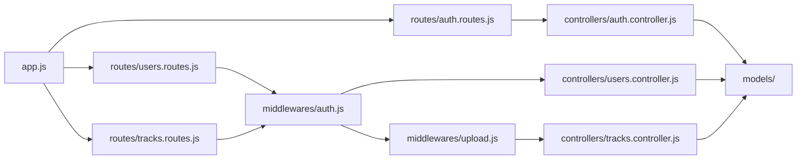

**16. Un logger structuré**
*Pourquoi* : `console.log` écrit du texte libre, sans niveau configurable ni
format exploitable par un outil de recherche.
*Comment* : le module `pino`, qui écrit du JSON avec niveau (`info`, `warn`,
`error`) et un identifiant par requête pour suivre toutes les lignes d'une même
requête.

**17. Tester les routes**
*Pourquoi* : les deux tests existants ne touchent aucune route utilisant la
base. Une régression sur la connexion ou l'upload passerait inaperçue.
*Comment* : `mongodb-memory-server` (une base MongoDB temporaire en mémoire) et
des tests pour chaque cas de `best-practices.md` : données invalides, absence de
JWT, ressource inexistante, doublon, fichier trop grand, mauvais type, accès à
la piste d'un autre utilisateur.

### Évolutivité

**18. Stocker les fichiers hors du serveur**
*Pourquoi* : `data/uploads/` est sur le disque d'une seule machine. Avec deux
serveurs derrière un répartiteur de charge, chacun ne verrait que la moitié des
fichiers ; sur un hébergement en conteneurs, le disque est souvent effacé à
chaque redéploiement.
*Comment* : un stockage objet (Amazon S3, Cloudflare R2…) ou GridFS dans
MongoDB. MongoDB continue de stocker les métadonnées.

**19. Permettre le streaming audio côté client**
*Pourquoi* : le backend sait déjà envoyer un morceau d'un fichier (`res.sendFile`
gère l'en-tête `Range`, ce qui permet de se déplacer dans la piste). Mais le
frontend télécharge tout le fichier en `blob` avant de le jouer, car une balise
`<audio src="...">` ne peut pas envoyer l'en-tête `Authorization`.
*Comment* : une URL signée à courte durée de vie (par exemple
`/api/tracks/:id/audio?sig=...`, valable 5 minutes) utilisable directement
dans `<audio>`.

**20. Quotas d'upload par utilisateur**
*Pourquoi* : la limite de 25 Mo vaut **par fichier**. Un utilisateur peut en
envoyer des milliers et remplir le disque.
*Comment* : avant d'accepter un upload, additionner les `size` des pistes de
l'utilisateur et refuser au-delà d'un plafond, en plus d'un *rate limiting* sur
`POST /api/tracks`.
