# Le frontend de Guitar Practice Cloud — guide de compréhension

Ce document explique le dossier `frontend-starter/` : son architecture, ses
technologies, ses workflows et la gestion de l'authentification côté navigateur.
Chaque notion commence par une définition courte (**C'est quoi ?**), puis
l'explication appliquée au projet. Les dernières parties listent ce qui manque
par rapport au sujet TP1, puis les améliorations possibles et leurs raisons.

Document jumeau : [BACKEND.md](BACKEND.md).

Les schémas sont au format Mermaid : ils s'affichent sur GitHub, GitLab et dans
VS Code (extension « Markdown Preview Mermaid Support »). On peut aus       si coller un
bloc sur https://mermaid.live pour l'exporter en image.

## Sommaire

1. [Vue d'ensemble](#1-vue-densemble)
2. [Technologies et modules](#2-technologies-et-modules)
3. [Architecture du code](#3-architecture-du-code)
4. [Le démarrage de l'application](#4-le-démarrage-de-lapplication)
5. [Les composants et les templates](#5-les-composants-et-les-templates)
6. [La réactivité : les Signals](#6-la-réactivité--les-signals)
7. [Les services et l'injection de dépendances](#7-les-services-et-linjection-de-dépendances)
8. [HTTP : HttpClient, Observables et proxy](#8-http--httpclient-observables-et-proxy)
9. [Le routage](#9-le-routage)
10. [L'authentification côté navigateur](#10-lauthentification-côté-navigateur)
11. [Les formulaires réactifs](#11-les-formulaires-réactifs)
12. [Les workflows, action par action](#12-les-workflows-action-par-action)
13. [Erreurs et logs](#13-erreurs-et-logs)
14. [Compilation, styles et tests](#14-compilation-styles-et-tests)
15. [Ce qui manque par rapport au sujet TP1](#15-ce-qui-manque-par-rapport-au-sujet-tp1)
16. [Améliorations possibles et pourquoi](#16-améliorations-possibles-et-pourquoi)

---

## 1. Vue d'ensemble

> **C'est quoi un frontend ?** La partie d'une application qui s'exécute dans
> le navigateur de l'utilisateur : elle affiche l'interface, réagit aux clics et
> dialogue avec le backend.

> **C'est quoi une SPA ?** (*Single Page Application*) Une application web qui
> charge **une seule page HTML** au départ, puis modifie l'affichage en
> JavaScript sans jamais recharger la page. Changer d'« écran » ne fait que
> remplacer un composant par un autre.

Le frontend de Guitar Practice Cloud est une SPA **Angular 22** écrite en
**TypeScript**. Il propose quatre écrans (connexion, inscription, profil,
bibliothèque audio) et ne stocke aucune donnée métier lui-même : tout passe par
l'API du backend.

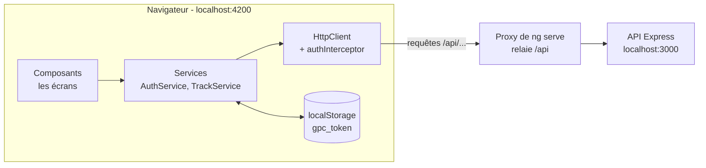

Règle fondamentale : **le frontend n'est pas un lieu sûr**. Tout son code est
téléchargé par le navigateur, lisible et modifiable avec les DevTools (F12).
Il ne contient donc aucun secret, et ses contrôles (formulaires, garde de
route) servent le **confort** de l'utilisateur. La **sécurité**, elle, est
assurée par le backend.

---

## 2. Technologies et modules

> **C'est quoi un framework ?** Une bibliothèque qui impose une structure au
> code et fournit les briques de base (affichage, navigation, HTTP…). On écrit
> du code *dans* le cadre qu'il définit.

### Le socle

| Technologie | Version installée | C'est quoi ? | Rôle dans le projet |
|---|---|---|---|
| **Angular** | 22.1 | Le framework de Google pour construire des SPA. | Toute l'application. |
| **TypeScript** | 6.0 | Du JavaScript avec des **types** vérifiés avant l'exécution. | Tous les fichiers `.ts`. |
| **RxJS** | 7.8 | Une bibliothèque de programmation réactive : manipuler des valeurs qui arrivent **plus tard** (réponses HTTP, événements). | Les `Observable` renvoyés par `HttpClient`, l'opérateur `tap()`. |
| **Angular CLI** (`ng`) | 22.1 | L'outil en ligne de commande d'Angular. | `ng serve` (développement), `ng build` (production), `ng test`. |
| **@angular/build** | 22.1 | Le système de compilation : esbuild pour compiler, Vite pour le serveur de développement. | Invoqué par le CLI. |
| **Vitest** | 4 | Un lanceur de tests unitaires. | Configuré, mais aucun test écrit. |

### Les modules Angular utilisés

| Module | C'est quoi ? | Ce qu'on en utilise |
|---|---|---|
| `@angular/core` | Le noyau : composants, injection, signals. | `Component`, `Injectable`, `inject`, `signal` |
| `@angular/platform-browser` | Le lanceur de l'application dans un navigateur. | `bootstrapApplication` |
| `@angular/router` | La navigation entre écrans sans rechargement. | `provideRouter`, `Routes`, `RouterLink`, `RouterOutlet`, `Router`, `CanActivateFn` |
| `@angular/common/http` | Le client HTTP. | `HttpClient`, `provideHttpClient`, `withInterceptors`, `HttpInterceptorFn` |
| `@angular/forms` | Les formulaires. | `ReactiveFormsModule`, `FormGroup`, `FormControl`, `Validators` |

### Ce qui n'est **pas** dans le projet

- **Pas de `NgModule`** (`app.module.ts`) : l'application est *standalone*, chaque composant déclare lui-même ses dépendances. Les tutoriels qui en montrent un sont antérieurs à Angular 15.
- **Pas de `zone.js`** : Angular fonctionne en mode *zoneless* ; il sait quand redessiner grâce aux signals et aux événements des templates (voir [section 6](#6-la-réactivité--les-signals)).
- **Pas de fichier `environment.ts`** : les URL de l'API sont relatives (`/api/...`) grâce au proxy (voir [section 8.5](#85-le-proxy-de-développement)).

---

## 3. Architecture du code

> **C'est quoi l'architecture d'un logiciel ?** La façon dont le code est
> découpé en parties, ce que fait chaque partie, et comment elles communiquent.

### Arborescence

```text
frontend-starter/
├── package.json              dépendances et scripts (start, build, test)
├── angular.json              configuration du CLI : point d'entrée, styles, builders
├── tsconfig.json             options TypeScript (mode strict, templates stricts)
├── proxy.conf.json           relaie /api vers localhost:3000 en développement
├── fichiers-audio-de-test/   MP3 fournis pour les essais
└── src/
    ├── index.html            la seule page HTML, contient <app-root>
    ├── main.ts               point d'entrée : démarre Angular et enregistre les fournisseurs
    ├── styles.css            styles globaux de toute l'application
    └── app/
        ├── routes.ts         table URL → composant
        ├── components/       l'INTERFACE
        │   ├── app/              coquille : en-tête, navigation, <router-outlet>
        │   ├── login-page/       /login
        │   ├── register-page/    /register
        │   ├── profile-page/     /profile
        │   └── tracks-page/      /tracks
        └── shared/           l'INFRASTRUCTURE
            ├── guards/           auth.guard.ts
            ├── interceptors/     auth.interceptor.ts
            ├── models/           user, auth-response, track, page
            └── services/         auth.service.ts, track.service.ts
```

Chaque dossier de composant contient trois fichiers qui vont ensemble :
`xxx.ts` (logique), `xxx.html` (apparence), `xxx.css` (style).

### Le découpage en couches

> **C'est quoi une couche ?** Un niveau du programme qui a une seule
> responsabilité et ne parle qu'aux niveaux voisins.

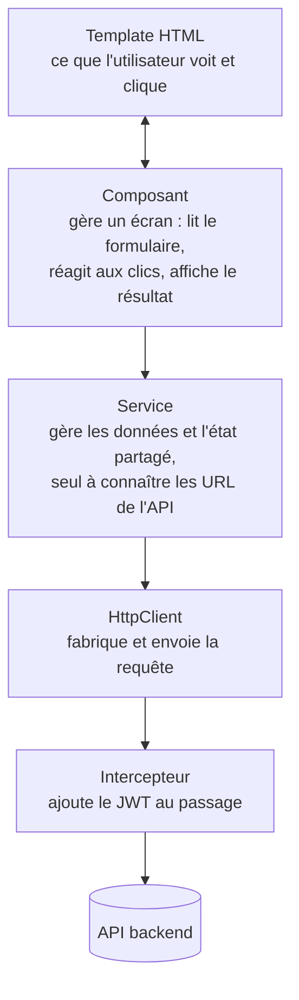

**La règle qui structure tout le projet** : un composant n'injecte **jamais**
`HttpClient`. Il passe par un service. Vérifié : aucun des cinq composants
n'importe `HttpClient`.

Pourquoi : si l'URL d'une route change, un seul fichier est à modifier (le
service) ; plusieurs écrans peuvent réutiliser le même appel ; et l'état partagé
(l'utilisateur connecté) vit à un seul endroit.

---

## 4. Le démarrage de l'application

> **C'est quoi le démarrage (ou *bootstrap*) ?** La séquence qui transforme une
> page HTML vide en application fonctionnelle : chargement du JavaScript,
> configuration, affichage du premier écran.

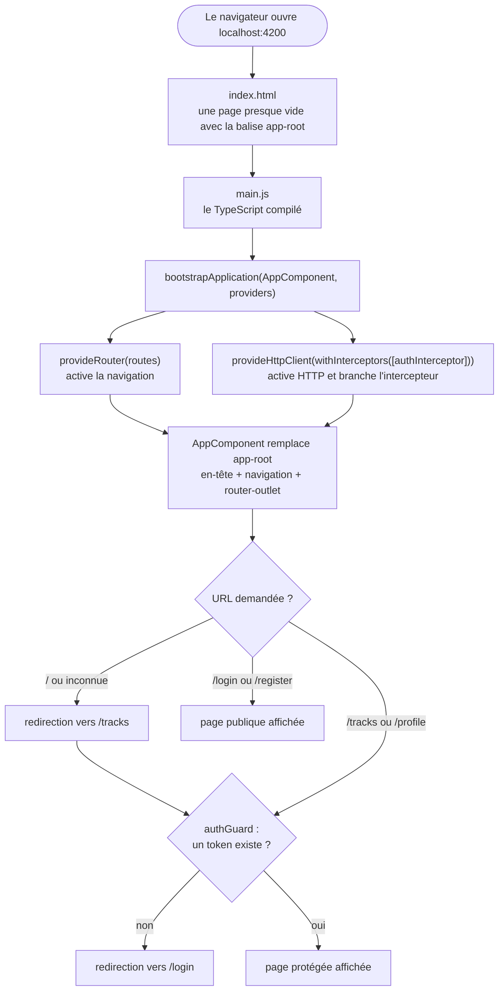

Tout est dans [main.ts](frontend-starter/src/main.ts) :

```ts
bootstrapApplication(AppComponent, {
  providers: [
    provideRouter(routes),                               // la navigation
    provideHttpClient(withInterceptors([authInterceptor])), // HTTP + JWT automatique
  ],
}).catch(console.error);
```

> **C'est quoi un *provider* (fournisseur) ?** Une instruction donnée à Angular
> au démarrage : « voici comment fabriquer tel service quand quelqu'un le
> demandera ». `provideHttpClient()` rend `HttpClient` injectable partout.

---

## 5. Les composants et les templates

> **C'est quoi un composant ?** Une brique d'interface réutilisable, faite d'une
> classe TypeScript (la logique) et d'un template HTML (l'apparence), reliés par
> le décorateur `@Component`.

> **C'est quoi un décorateur ?** Une annotation qui commence par `@` et qui
> ajoute des informations à une classe. `@Component({...})` dit à Angular
> « cette classe est un composant, voici son template et son style ».

```ts
@Component({
  imports: [ReactiveFormsModule, RouterLink],  // ce que le template utilise
  templateUrl: './login-page.html',
  styleUrl: './login-page.css',
})
export class LoginPageComponent { ... }
```

### Le lien entre la classe et le template : le *binding*

> **C'est quoi le *data binding* ?** Le mécanisme qui relie automatiquement les
> propriétés de la classe à l'affichage, et les actions de l'utilisateur aux
> méthodes de la classe.

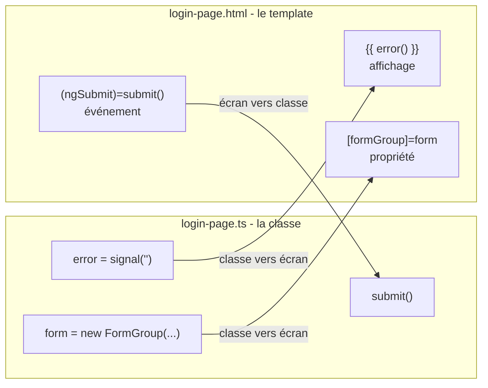

| Syntaxe | Sens | Direction | Exemple du projet |
|---|---|---|---|
| `{{ expr }}` | **interpolation** : afficher une valeur | classe → écran | `{{ user.name }}` |
| `[prop]="expr"` | **property binding** : alimenter une propriété d'élément | classe → écran | `[disabled]="!file"`, `[src]="audioUrl()"` |
| `[attr.nom]="expr"` | **attribute binding** : alimenter un attribut HTML | classe → écran | `[attr.aria-label]="'Lire ' + track.title"` |
| `(evt)="methode()"` | **event binding** : réagir à un événement | écran → classe | `(click)="load()"`, `(change)="choose($event)"` |
| `formControlName="x"` | relier un `<input>` à un champ du formulaire | les deux sens | `formControlName="email"` |

Moyen mnémotechnique : `[ ]` est une boîte qu'on **remplit** (la classe
alimente l'écran) ; `( )` est une oreille qui **écoute** (l'écran prévient la
classe). `$event` désigne l'événement du navigateur, par exemple le fichier
choisi dans un `<input type="file">`.

**Protection intégrée** : `{{ }}` échappe automatiquement le HTML. Si un
utilisateur s'appelle `<script>alert(1)</script>`, Angular affiche ce texte tel
quel au lieu de l'exécuter. C'est une protection native contre les attaques XSS.

### Le flux de contrôle dans les templates

> **C'est quoi le *control flow* ?** Des blocs `@if`, `@for`, `@switch` qui
> affichent ou répètent une partie du template selon les données.

```html
@if (error()) {
  <p class="error">{{ error() }}</p>
}

@for (track of tracks(); track track.id) {
  <div class="track">{{ track.title }}</div>
} @empty {
  <p>Aucune piste.</p>
}
```

- `@if` affiche le bloc seulement si la condition est vraie ;
- `@for` répète le bloc pour chaque élément ; `track track.id` indique à Angular comment reconnaître un élément d'un rendu à l'autre, pour ne redessiner que ce qui a changé ;
- `@empty` s'affiche si la liste est vide ;
- `@if (auth.currentUser(); as user)` affiche le bloc si l'utilisateur existe **et** le nomme `user` à l'intérieur.

Ancienne syntaxe, encore très présente sur internet : `*ngIf`, `*ngFor`.
Angular 22 recommande la nouvelle.

### Les cinq composants

| Composant | URL | Ce qu'il affiche | Ce qu'il fait |
|---|---|---|---|
| [AppComponent](frontend-starter/src/app/components/app/app.ts) | toutes | en-tête, trois liens, `<router-outlet />` | rien d'autre : c'est la coquille. `<router-outlet />` est l'emplacement où s'affiche la page de la route courante. |
| [LoginPageComponent](frontend-starter/src/app/components/login-page/login-page.ts) | `/login` | formulaire email + mot de passe, message d'erreur | appelle `auth.login()`, puis va sur `/tracks` |
| [RegisterPageComponent](frontend-starter/src/app/components/register-page/register-page.ts) | `/register` | formulaire nom + email + mot de passe | appelle `auth.register()`, puis va sur `/profile` |
| [ProfilePageComponent](frontend-starter/src/app/components/profile-page/profile-page.ts) | `/profile` | bouton « Charger mon profil », puis nom, email, date d'inscription et formulaire de changement de nom | appelle `auth.profile()` puis `auth.update()` |
| [TracksPageComponent](frontend-starter/src/app/components/tracks-page/tracks-page.ts) | `/tracks` | formulaire d'upload, liste paginée, lecteur audio | appelle `TrackService` ; charge la liste dès sa création (constructeur) |

Détail utile : dans `ProfilePageComponent`, `auth` est déclaré `readonly auth`
**sans** `private`, pour que le template puisse lire `auth.currentUser()`.
Tout ce qui est `private` est invisible depuis le template.

---

## 6. La réactivité : les Signals

> **C'est quoi la réactivité ?** La capacité d'une interface à se mettre à jour
> **toute seule** quand les données changent, sans que le développeur modifie
> la page à la main.

> **C'est quoi un Signal ?** Une « boîte » qui contient une valeur et qui
> **prévient** tous ceux qui la lisent quand cette valeur change.

```ts
readonly error = signal('');   // création avec une valeur initiale

error()               // LIRE  — les parenthèses sont obligatoires
error.set('Oups')     // ÉCRIRE
```

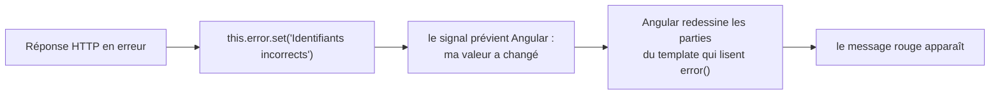

Le projet n'utilise pas `zone.js` : Angular redessine un composant quand **un
signal qu'il lit change**, ou juste après **un événement de son template** (un
clic, une saisie). C'est pour cela que l'état affiché est rangé dans des
signals : `error`, `tracks`, `page`, `pages`, `loading`, `audioUrl`,
`currentUser`, `token`.

### Signal ou `localStorage` : la différence à savoir expliquer

> **C'est quoi `localStorage` ?** Un petit espace de stockage clé/valeur du
> navigateur, propre à chaque site, qui **survit** au rechargement de la page
> et à la fermeture du navigateur.

| | Signal | `localStorage` |
|---|---|---|
| Où ? | en mémoire, dans le JavaScript | sur le disque, géré par le navigateur |
| Durée de vie | disparaît au rechargement (F5) | persiste jusqu'à suppression |
| Réactif ? | **oui** : l'écran se met à jour tout seul | **non** : personne n'est prévenu d'un changement |
| Type de valeur | n'importe quel objet | uniquement du texte |
| Dans le projet | `currentUser`, `token` | la clé `gpc_token` |

`AuthService` utilise **les deux** pour le token : `localStorage` pour survivre
au rechargement, le signal pour que l'interface réagisse. Au démarrage, le
signal est initialisé depuis `localStorage` :

```ts
readonly token = signal<string | null>(localStorage.getItem('gpc_token'));
```

`currentUser`, lui, n'est pas sauvegardé : il repart à `null` après un F5
(voir [workflow 12.7](#127-rechargement-de-la-page-f5)).

---

## 7. Les services et l'injection de dépendances

> **C'est quoi un service ?** Une classe sans affichage qui regroupe du code
> utile à plusieurs composants : appels HTTP, état partagé, calculs.

> **C'est quoi l'injection de dépendances ?** Au lieu de créer lui-même les
> objets dont il a besoin (`new AuthService()`), un composant les **demande** à
> Angular, qui les fabrique et les lui fournit.

```ts
@Injectable({ providedIn: 'root' })   // Angular sait fabriquer ce service
export class AuthService {
  private readonly http = inject(HttpClient);   // le service demande HttpClient
}

export class LoginPageComponent {
  private readonly auth = inject(AuthService);  // le composant demande AuthService
}
```

`providedIn: 'root'` signifie : **une seule instance** pour toute
l'application (un *singleton*). C'est ce qui rend l'état partagé possible :

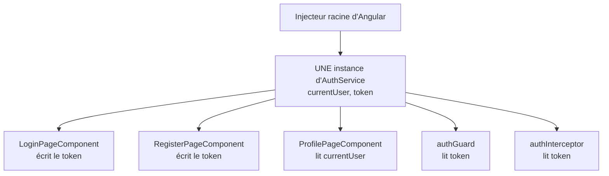

Quand la page de connexion écrit le token, le garde et l'intercepteur le voient
immédiatement : ils consultent **le même objet**.

### Les deux services du projet

[AuthService](frontend-starter/src/app/shared/services/auth.service.ts) —
l'utilisateur et sa session :

| Membre | Rôle |
|---|---|
| `currentUser` | signal : l'utilisateur connecté, ou `null` |
| `token` | signal : le JWT, initialisé depuis `localStorage` |
| `login(email, password)` | `POST /api/auth/login`, puis mémorise la session |
| `register(name, email, password)` | `POST /api/auth/register`, puis mémorise la session |
| `profile()` | `GET /api/users/me`, puis met à jour `currentUser` |
| `update(name)` | `PUT /api/users/me`, puis met à jour `currentUser` |
| `logout()` | vide `localStorage`, `token` et `currentUser` (aucun appel réseau) |
| `storeAuthentication()` | privée : écrit le token dans `localStorage` et dans les deux signals |

[TrackService](frontend-starter/src/app/shared/services/track.service.ts) —
les pistes audio :

| Méthode | Appel | Particularité |
|---|---|---|
| `list(page, limit)` | `GET /api/tracks?page=&limit=` | `params` transforme l'objet en *query string* |
| `upload(file, title)` | `POST /api/tracks` | corps `FormData` : Angular envoie automatiquement du `multipart/form-data` |
| `audio(id)` | `GET /api/tracks/:id/audio` | `responseType: 'blob'` : on attend des octets, pas du JSON |

---

## 8. HTTP : HttpClient, Observables et proxy

### 8.1 HttpClient

> **C'est quoi `HttpClient` ?** Le service Angular qui envoie des requêtes HTTP
> et convertit automatiquement les réponses JSON en objets TypeScript.

```ts
this.http.post<AuthResponse>('/api/auth/login', { email, password })
```

Le `<AuthResponse>` indique à TypeScript la forme attendue de la réponse. Il ne
vérifie rien à l'exécution : c'est une promesse faite au compilateur, qui doit
correspondre au contrat de l'API.

> **C'est quoi un modèle (ou interface) TypeScript ?** La description de la
> forme d'un objet (`User`, `Track`…). Elle n'existe qu'à la compilation et
> disparaît du code final.

Les quatre modèles de `shared/models/` recopient les formats de
`API_CONTRACT.md` : `User`, `AuthResponse`, `Track`, `Page<T>`.

### 8.2 Les Observables

> **C'est quoi un Observable ?** Un objet RxJS qui représente une ou plusieurs
> valeurs qui arriveront **plus tard**. Il ne fait rien tant que personne ne
> s'y **abonne** avec `subscribe()`.

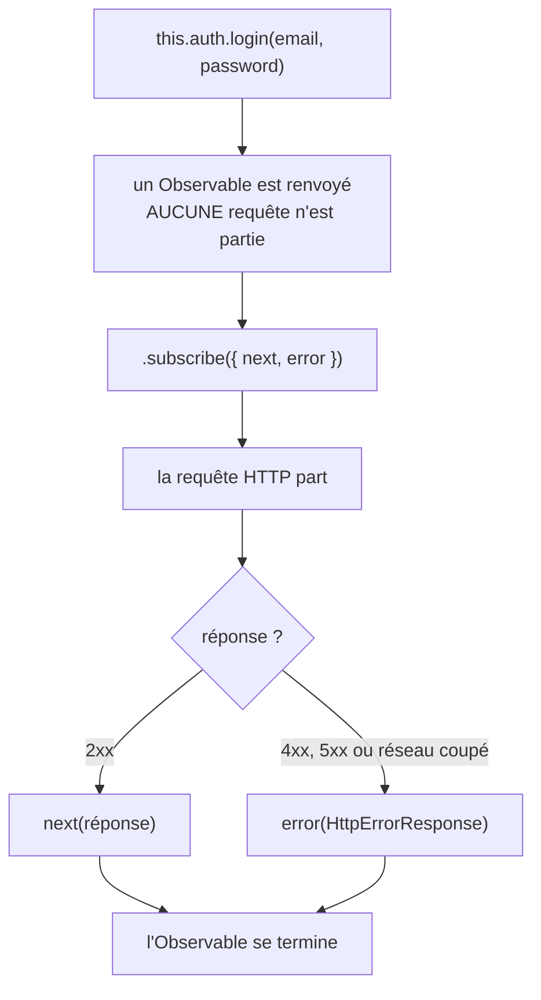

**Piège n°1 du débutant** : oublier `subscribe()`. Le code ne plante pas, mais
la requête n'est jamais envoyée.

Chaque composant s'abonne avec les deux chemins :

```ts
this.auth.login(values.email, values.password).subscribe({
  next: () => { /* succès : rediriger */ },
  error: (error) => { /* échec : afficher un message */ },
});
```

**Pourquoi pas une Promise ?** Une Promise part immédiatement et ne produit
qu'une valeur. Un Observable est paresseux (rien ne part sans abonnement),
peut produire plusieurs valeurs (utile pour suivre la progression d'un upload)
et se compose avec des opérateurs.

**Faut-il se désabonner ?** Pas pour `HttpClient` : l'Observable se termine de
lui-même après une réponse. Ce serait nécessaire pour un flux qui ne se termine
jamais (un minuteur, un WebSocket).

### 8.3 L'opérateur `tap()`

> **C'est quoi un opérateur RxJS ?** Une fonction qu'on branche sur un
> Observable avec `.pipe(...)` pour transformer ou observer les valeurs qui
> passent.

`tap()` exécute une action **au passage** sans modifier la valeur. C'est lui qui
mémorise la session dans le service, avant que le composant reçoive la réponse :

```ts
login(email: string, password: string) {
  return this.http
    .post<AuthResponse>('/api/auth/login', { email, password })
    .pipe(tap((response) => this.storeAuthentication(response)));
}
```

Ordre à l'arrivée d'une réponse : **`tap()` du service, puis `next` du
composant**. En cas d'erreur, `tap()` n'est pas exécuté : rien n'est stocké.

### 8.4 L'intercepteur

> **C'est quoi un intercepteur HTTP ?** Une fonction placée sur le trajet de
> **toutes** les requêtes (et réponses) de `HttpClient`, qui peut les modifier.

[auth.interceptor.ts](frontend-starter/src/app/shared/interceptors/auth.interceptor.ts) :

```ts
export const authInterceptor: HttpInterceptorFn = (request, next) => {
  const token = inject(AuthService).token();
  return next(
    token
      ? request.clone({ setHeaders: { Authorization: `Bearer ${token}` } })
      : request,
  );
};
```

- `request.clone(...)` : les requêtes Angular sont **immuables**, on ne peut pas les modifier, on en fabrique une copie enrichie ;
- `next(...)` : passe la requête à la suite de la chaîne (l'envoi réseau) ;
- résultat : aucun service n'a à penser au header `Authorization`, il est ajouté **une seule fois, pour tous**.

### 8.5 Le proxy de développement

> **C'est quoi un proxy ?** Un intermédiaire qui reçoit une requête et la
> retransmet à un autre serveur.

Les services appellent `/api/...` : une URL **relative**, donc envoyée à
`localhost:4200`, où Angular tourne. [proxy.conf.json](frontend-starter/proxy.conf.json)
demande au serveur de développement de relayer ces requêtes vers le backend :

```json
{ "/api": { "target": "http://localhost:3000", "secure": false } }
```

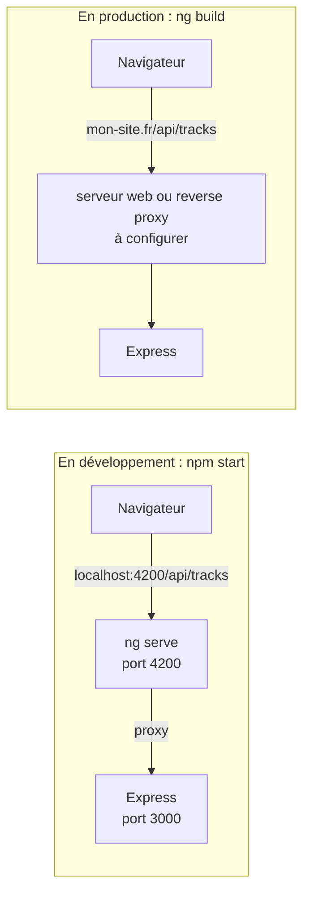

> **C'est quoi CORS ?** Une règle du navigateur qui bloque par défaut les
> appels JavaScript vers une autre origine (autre domaine ou autre port).

Grâce au proxy, le navigateur croit que tout vient de `localhost:4200` :
**aucun problème CORS en développement**. Dans l'onglet Network, les requêtes
apparaissent donc sur le port 4200, pas 3000.

Le proxy n'existe qu'avec `ng serve`. Une version de production (`ng build`) ne
produit que des fichiers statiques : il faudra un serveur web qui fasse le même
relais (voir [amélioration n°11](#16-améliorations-possibles-et-pourquoi)).

---

## 9. Le routage

> **C'est quoi le routage côté client ?** Le mécanisme qui associe une URL du
> navigateur à un composant, et change d'écran **sans recharger la page**.

[routes.ts](frontend-starter/src/app/routes.ts) :

| Chemin | Composant | Protection |
|---|---|---|
| `''` (racine) | redirige vers `tracks` (`pathMatch: 'full'` : seulement si l'URL est exactement vide) | — |
| `login` | `LoginPageComponent` | publique |
| `register` | `RegisterPageComponent` | publique |
| `profile` | `ProfilePageComponent` | `canActivate: [authGuard]` |
| `tracks` | `TracksPageComponent` | `canActivate: [authGuard]` |
| `**` (tout le reste) | redirige vers `tracks` | — |

Les trois outils de navigation :

| Outil | Où | Rôle |
|---|---|---|
| `<router-outlet />` | `app.html` | l'emplacement où s'affiche le composant de la route active |
| `routerLink="/profile"` | templates | un lien qui change d'écran sans recharger la page (au lieu de `href`) |
| `router.navigateByUrl('/tracks')` | code TypeScript | naviguer par programme, par exemple après une connexion réussie |

### Le garde de route

> **C'est quoi un garde (*guard*) ?** Une fonction exécutée **avant** d'entrer
> sur une route, qui autorise l'accès ou redirige ailleurs.

```ts
export const authGuard: CanActivateFn = () => {
  const auth = inject(AuthService);
  const router = inject(Router);
  return auth.token() ? true : router.createUrlTree(['/login']);
};
```

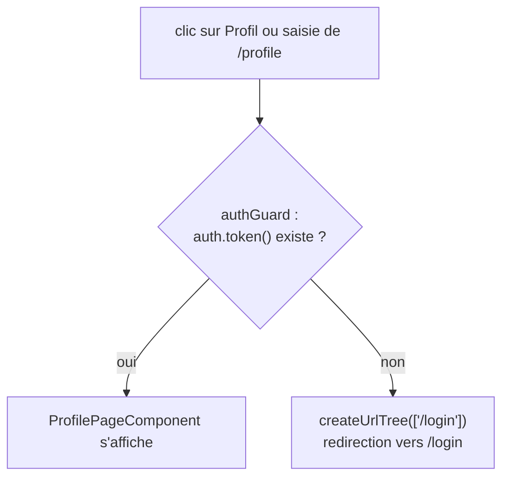

`createUrlTree` renvoie une **redirection** plutôt que `false` : l'utilisateur
arrive sur la page de connexion au lieu de rester devant un écran vide.

⚠️ Deux limites à connaître :

- le garde vérifie la **présence** du token, pas sa **validité** : un token expiré passe le garde, et c'est le backend qui répondra `401` ;
- le garde n'est **pas** une sécurité : n'importe qui peut modifier le JavaScript ou appeler l'API directement. Il évite seulement d'afficher une page qui ne pourrait pas fonctionner.

---

## 10. L'authentification côté navigateur

> **C'est quoi l'authentification côté frontend ?** Ce n'est pas la
> vérification de l'identité (le backend s'en charge) : c'est la **gestion de
> la session** — obtenir le token, le conserver, le joindre aux requêtes, et
> adapter l'interface selon que l'utilisateur est connecté ou non.

> **C'est quoi un JWT ?** Un texte signé par le backend après la connexion, que
> le frontend renvoie à chaque requête pour prouver l'identité de
> l'utilisateur. Le frontend ne peut ni le fabriquer ni le vérifier : il le
> transporte. Détails dans [BACKEND.md, section 8.2](BACKEND.md#82-le-json-web-token-jwt).

### Les quatre pièces du dispositif

| Pièce | Fichier | Rôle |
|---|---|---|
| **Obtenir** le token | `AuthService.login()` / `register()` | reçoit `{ token, user }` du backend |
| **Conserver** le token | `storeAuthentication()` | `localStorage` + signals `token` et `currentUser` |
| **Joindre** le token | `authInterceptor` | ajoute `Authorization: Bearer ...` à chaque requête |
| **Adapter** l'interface | `authGuard` | interdit `/profile` et `/tracks` sans token |

### Les états de la session

> **C'est quoi un diagramme d'états ?** Un schéma des situations possibles d'un
> système et des événements qui le font passer de l'une à l'autre.

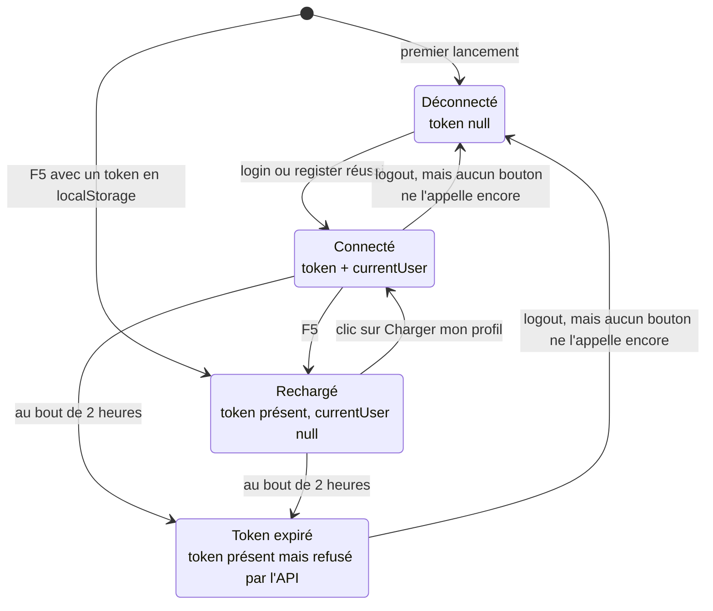

Les états **Rechargé** et **Token expiré** sont des situations boiteuses que
le code actuel ne gère pas : c'est précisément le travail de la Mission 1
(voir [section 15](#15-ce-qui-manque-par-rapport-au-sujet-tp1)).

### Où le JWT est visible, et ce qu'il ne faut pas faire

- Onglet **Application** des DevTools → Local Storage → `gpc_token` ;
- onglet **Network** → en-tête `Authorization` de chaque requête protégée ;
- onglet **Network** → réponse de `login` et `register`.

Le sujet interdit de capturer ou de transmettre un JWT : il permet d'agir au nom
de l'utilisateur jusqu'à son expiration. Le code respecte cette règle : aucun
`console.log` n'affiche le token.

---

## 11. Les formulaires réactifs

> **C'est quoi un formulaire réactif (*Reactive Form*) ?** Un formulaire dont la
> structure, les valeurs et les règles de validation sont décrites **dans la
> classe TypeScript**, le template ne faisant que s'y brancher.

| Brique | C'est quoi ? |
|---|---|
| `FormControl` | un champ : sa valeur, ses validateurs, son état |
| `FormGroup` | un ensemble de champs, valide seulement si tous le sont |
| `Validators` | des règles prêtes à l'emploi : `required`, `email`, `minLength(8)`… |
| `nonNullable: true` | le champ revient à sa valeur initiale lors d'un `reset()` au lieu de devenir `null` ; son type est `string` et non `string \| null` |

```ts
readonly form = new FormGroup({
  name: new FormControl('', { nonNullable: true, validators: [Validators.required] }),
  email: new FormControl('', { nonNullable: true, validators: [Validators.required, Validators.email] }),
  password: new FormControl('', { nonNullable: true, validators: [Validators.required] }),
});
```

```html
<form [formGroup]="form" (ngSubmit)="submit()">
  <label>Email<input type="email" formControlName="email" /></label>
</form>
```

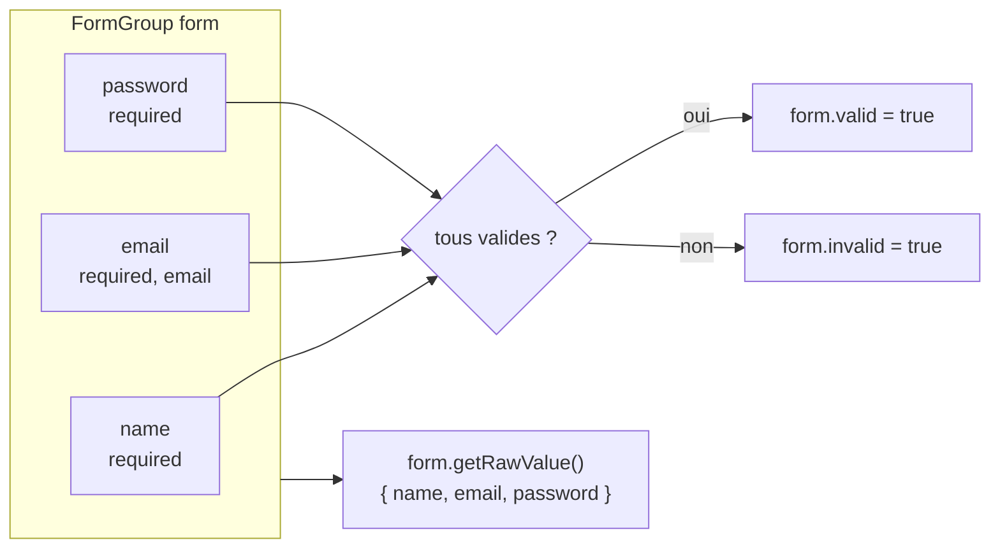

Chaque champ expose son état, utile pour afficher des messages d'erreur :

| Propriété | Vraie quand… |
|---|---|
| `valid` / `invalid` | les règles sont respectées / non respectées |
| `touched` | l'utilisateur est entré puis sorti du champ |
| `dirty` | l'utilisateur a modifié la valeur |
| `errors` | objet décrivant l'erreur, par exemple `{ required: true }` ou `{ email: true }` |

Exemple d'accès : `form.controls.email.invalid && form.controls.email.touched`.

Le composant `TracksPageComponent` utilise un `FormControl` **seul**, sans
groupe, relié par `[formControl]="title"` : c'est possible pour un champ isolé.

---

## 12. Les workflows, action par action

> **C'est quoi un workflow ?** L'enchaînement ordonné des étapes que suit une
> opération, du début à la fin, en passant par les différents composants
> (ici : template, composant, service, intercepteur, API).

### 12.1 Inscription

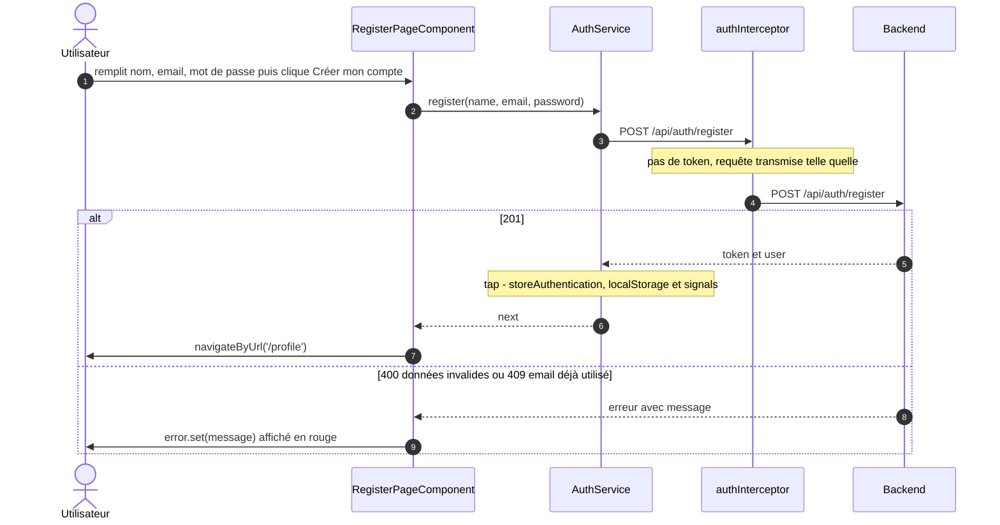

### 12.2 Connexion

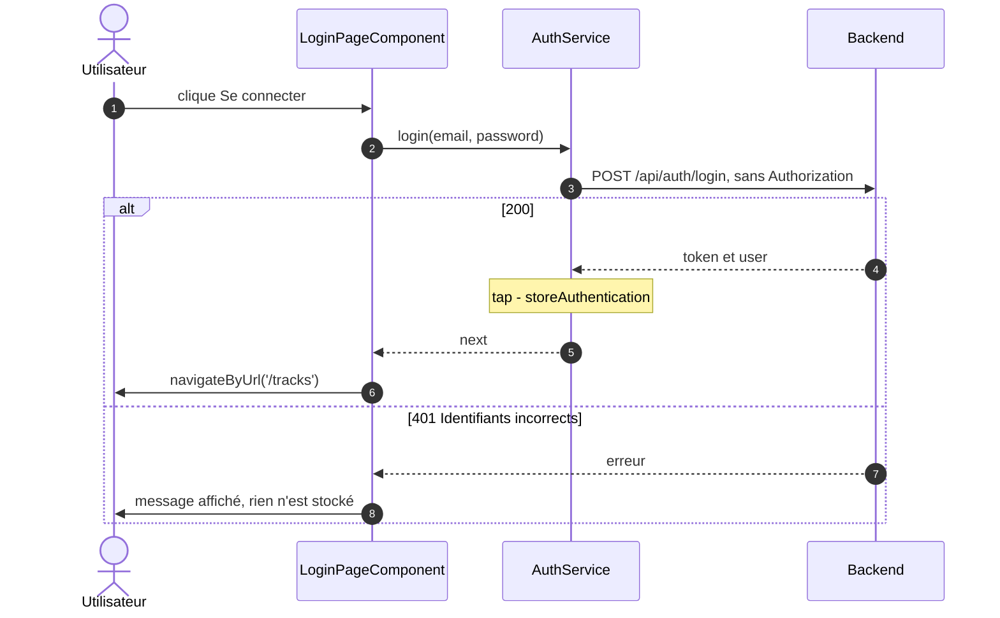

Le schéma annoté complet, qui traverse aussi le backend, est dans
[MISSION_0_CARTOGRAPHIE.md](MISSION_0_CARTOGRAPHIE.md#4-schéma-annoté-du-flux--se-connecter-).

### 12.3 Profil : lecture puis modification du nom

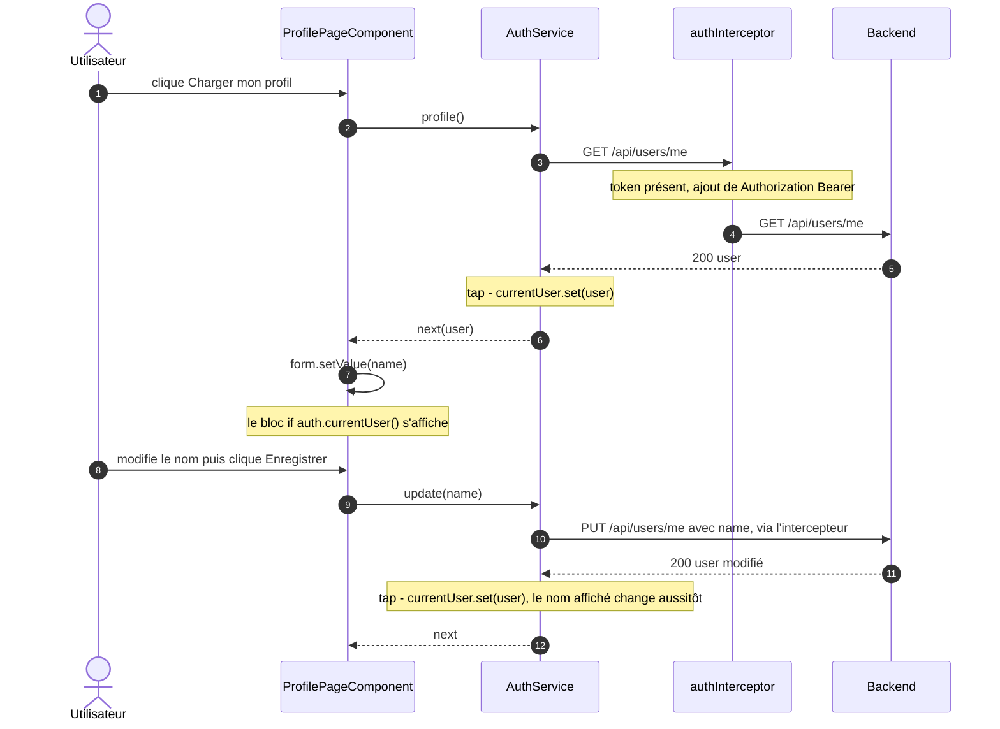

**Réponse à la question du sujet** « où s'effectue la mise à jour du profil ? » :

| Côté | Fichier | Rôle |
|---|---|---|
| front, template | `profile-page.html` | formulaire et `(ngSubmit)="save()"` |
| front, composant | `profile-page.ts` → `save()` | lit le formulaire et délègue |
| front, service | `auth.service.ts` → `update()` | `PUT /api/users/me` puis `currentUser.set()` |
| front, infrastructure | `auth.interceptor.ts` | ajoute le JWT |
| back, route | `backend/src/app.js` → `app.put("/api/users/me", auth, ...)` | modifie le nom en base |
| back, modèle | `backend/src/models/User.js` | validation (2 caractères minimum), `toPublic()` |

### 12.4 Liste des pistes et pagination

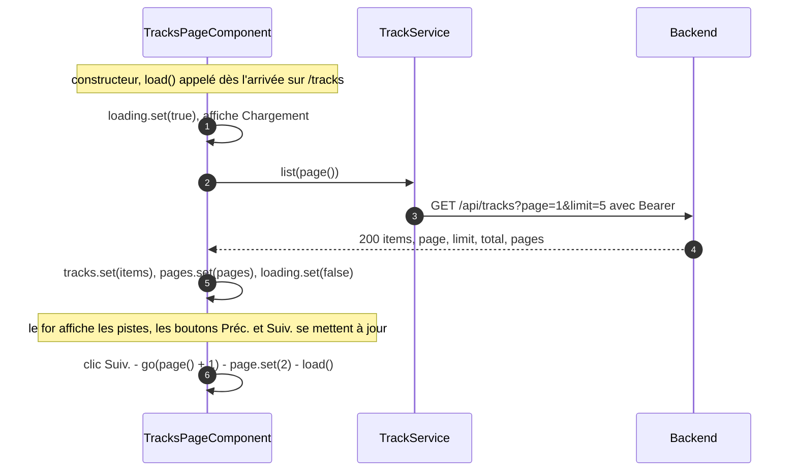

Les boutons sont désactivés aux bornes : `[disabled]="page() === 1"` et
`[disabled]="page() === pages()"`.

### 12.5 Upload d'un fichier audio

> **C'est quoi `FormData` ?** Un objet du navigateur qui représente le contenu
> d'un formulaire, fichiers compris. Envoyé par `HttpClient`, il produit
> automatiquement une requête `multipart/form-data`.

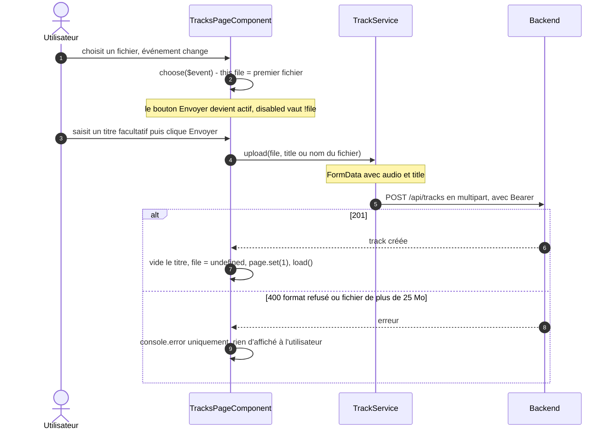

### 12.6 Lecture audio

> **C'est quoi un Blob ?** Un bloc de données binaires brutes dans le
> navigateur, ici le contenu du fichier audio.

> **C'est quoi une *object URL* ?** Une adresse temporaire (`blob:http://...`)
> créée par `URL.createObjectURL()`, qui permet à une balise `<audio>` de lire
> un Blob présent en mémoire.

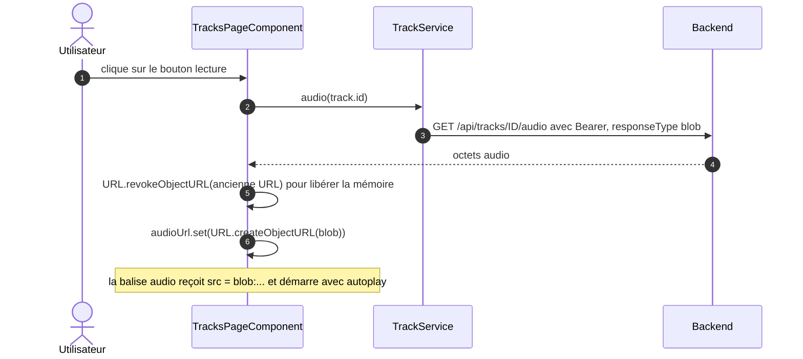

**Pourquoi ce détour par un Blob ?** Une balise `<audio src="/api/...">`
chargerait le fichier elle-même, mais **sans** l'en-tête `Authorization` : le
backend répondrait `401`. On télécharge donc le fichier avec `HttpClient`
(qui passe par l'intercepteur), puis on le donne à `<audio>`. Inconvénient : le
fichier est téléchargé **en entier** avant de commencer.

### 12.7 Rechargement de la page (F5)

Ce workflow montre concrètement la différence entre Signal et `localStorage`.

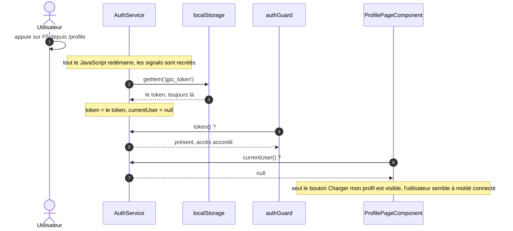

### 12.8 Token expiré

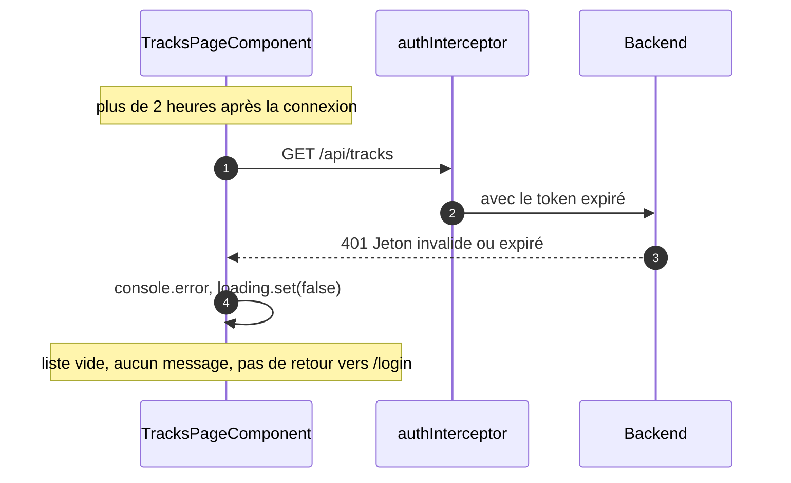

---

## 13. Erreurs et logs

> **C'est quoi un log côté frontend ?** Un message écrit dans la **console** des
> DevTools (F12 → Console) avec `console.debug` ou `console.error`.

Chaque composant préfixe ses messages :

| Préfixe | Exemples |
|---|---|
| `[LoginPage]` | « Connexion réussie », « Échec de connexion » |
| `[RegisterPage]` | « Inscription réussie », « Échec de l'inscription » |
| `[ProfilePage]` | « Profil chargé », « Enregistrement impossible » |
| `[TracksPage]` | « Pistes chargées », « Fichier sélectionné », « Envoi impossible » |

`console.debug` n'apparaît que si le niveau **Verbose** est activé dans le
filtre de la console.

> **C'est quoi `HttpErrorResponse` ?** L'objet qu'Angular passe au callback
> `error` : il contient le statut (`status`), l'URL et le corps renvoyé par le
> serveur (`error`), par exemple `{ message: "Identifiants incorrects" }`.

Les composants de connexion et d'inscription lisent `error.error?.message` et
l'affichent, avec un message de secours (`?? 'Erreur de connexion'`). Les autres
écrans (profil, pistes) n'écrivent l'erreur **que** dans la console.

---

## 14. Compilation, styles et tests

### La compilation

> **C'est quoi compiler ?** Transformer le code source (TypeScript et templates
> Angular) en JavaScript que le navigateur sait exécuter.

> **C'est quoi la compilation AOT ?** (*Ahead-of-Time*) Angular compile les
> templates HTML **avant** l'envoi au navigateur, et non pendant l'exécution.

| Commande | Ce qu'elle fait |
|---|---|
| `npm start` | `ng serve --proxy-config proxy.conf.json` : compile, sert sur le port 4200, recompile et recharge le navigateur à chaque sauvegarde, active le proxy |
| `npm run build` | `ng build` : produit les fichiers optimisés dans `dist/` |
| `npm test` | `ng test --watch=false` : lance Vitest |

Le mode strict est activé (`strict` et `strictTemplates` dans `tsconfig.json`) :
les **templates aussi** sont vérifiés. Écrire `{{ user.nom }}` au lieu de
`{{ user.name }}` fait échouer la compilation au lieu d'afficher du vide.

Résultat actuel de `ng build` : compilation sans erreur ni avertissement, un
seul fichier JavaScript de 293 Ko (77 Ko transférés après compression) et
1,3 Ko de CSS.

### Les styles

Tous les styles sont dans [styles.css](frontend-starter/src/styles.css),
appliqués à toute l'application. Les fichiers `.css` des composants sont
quasiment vides (26 à 60 octets).

> **C'est quoi l'encapsulation des styles ?** Par défaut, le CSS d'un composant
> ne s'applique **qu'à ce composant** : Angular ajoute des attributs uniques
> pour éviter qu'un `.card` d'une page déborde sur une autre.

### Les tests

> **C'est quoi un test unitaire ?** Un petit programme qui vérifie une seule
> unité de code (un service, un composant) isolée du reste.

Vitest est configuré, mais le projet ne contient **aucun** fichier de test
(`*.spec.ts`). Voir l'[amélioration n°15](#16-améliorations-possibles-et-pourquoi).

---

## 15. Ce qui manque par rapport au sujet TP1

Ce sont les **exigences de la Mission 1**, pas des améliorations optionnelles.

| # | Exigence du sujet | État actuel | Cause dans le code |
|---|---|---|---|
| 1 | « bouton de déconnexion avec nettoyage de l'état local » | absent | `AuthService.logout()` existe, mais `app.html` n'a aucun bouton qui l'appelle |
| 2 | « gestion d'un `401`, avec retour vers `/login` si le token est invalide ou expiré » | absent | le garde teste la présence du token, pas sa validité ; rien n'écoute les réponses `401` (workflow [12.8](#128-token-expiré)) |
| 3 | « validations et messages d'erreur compréhensibles » | partiel | les `Validators` existent, mais aucun message par champ n'est affiché et un formulaire invalide est quand même envoyé |
| 4 | « chargement de `/api/users/me` lorsque le profil est demandé » | partiel | il faut cliquer sur « Charger mon profil » ; après un F5, `currentUser` est `null` (workflow [12.7](#127-rechargement-de-la-page-f5)) |
| 5 | état d'authentification cohérent dans l'interface | absent | la navigation affiche toujours « Connexion », même connecté |

Pistes de solution, à discuter avant d'écrire le code :

1. un bouton dans `app.html` qui appelle `auth.logout()` puis navigue vers `/login` ;
2. un second intercepteur qui observe les réponses : sur un `401` d'une route autre que `/api/auth/*`, appeler `logout()` et rediriger vers `/login` ;
3. dans les templates, des `@if (form.controls.email.invalid && form.controls.email.touched)` avec un message, et `[disabled]="form.invalid"` sur les boutons ; ajouter `Validators.minLength(8)` au mot de passe de l'inscription, comme l'exige le backend ;
4. charger le profil automatiquement : dans le constructeur de `ProfilePageComponent`, ou au démarrage si un token existe ;
5. utiliser `auth.currentUser()` ou `auth.token()` dans `app.html` pour afficher « Connexion » ou « Déconnexion ».

---

## 16. Améliorations possibles et pourquoi

Au-delà des exigences du sujet, le frontend est bien structuré : séparation
composant / service respectée, signals pour l'état, intercepteur central,
formulaires réactifs, compilation stricte. Voici ce qu'on améliorerait ensuite.

### Vue d'ensemble

| # | Amélioration | Catégorie | Priorité |
|---|---|---|---|
| 1 | Retirer les identifiants démo du code | sécurité | 🟠 moyenne |
| 2 | N'envoyer le JWT qu'à notre API | sécurité | 🟠 moyenne |
| 3 | Mieux protéger le token contre le vol | sécurité | 🟡 basse |
| 4 | Empêcher le double envoi | robustesse | 🟠 moyenne |
| 5 | Afficher les erreurs des pistes et du profil | expérience utilisateur | 🟠 moyenne |
| 6 | Corriger l'affichage de la taille des fichiers | bug | 🔴 haute |
| 7 | Typer les erreurs avec `HttpErrorResponse` | qualité | 🟡 basse |
| 8 | Réinitialiser le champ fichier après l'envoi | expérience utilisateur | 🟡 basse |
| 9 | Libérer l'URL audio en quittant la page | robustesse | 🟡 basse |
| 10 | Barre de progression de l'upload | expérience utilisateur | 🟡 basse |
| 11 | Préparer la production : URL de l'API | déploiement | 🟠 moyenne |
| 12 | Charger les pages à la demande | performance | 🟡 basse |
| 13 | Dériver l'état avec `computed()` | qualité | 🟡 basse |
| 14 | Ranger les styles dans les composants | maintenabilité | 🟡 basse |
| 15 | Écrire des tests | qualité | 🟠 moyenne |
| 16 | Annoncer les erreurs aux lecteurs d'écran | accessibilité | 🟡 basse |
| 17 | Lire l'audio en streaming | évolutivité | 🟡 basse |
| 18 | Permettre la suppression d'une piste | fonctionnalité | 🟡 basse |

### Sécurité

**1. Retirer les identifiants démo du code** — `login-page.ts:17` et `:21`
*Pourquoi* : le formulaire est pré-rempli avec `demo@example.com` /
`Demo1234!`. Le compte démo est public, mais les consignes du projet interdisent
tout mot de passe dans le code Angular, et ce code part tel quel dans le fichier
JavaScript téléchargé par chaque visiteur. C'est aussi une mauvaise habitude qui
finit un jour par exposer un vrai mot de passe.
*Comment* : valeurs initiales vides.

**2. N'envoyer le JWT qu'à notre API** — `auth.interceptor.ts`
*Pourquoi* : l'intercepteur ajoute le token à **toutes** les requêtes de
`HttpClient`. Le jour où l'application appellera un service externe (une API de
paroles, un CDN…), le JWT lui sera envoyé : ce service pourrait alors agir au
nom de l'utilisateur.
*Comment* : n'ajouter l'en-tête que si `request.url.startsWith('/api/')`.

**3. Mieux protéger le token contre le vol**
*Pourquoi* : tout script qui s'exécute dans la page peut lire `localStorage`.
Si une faille XSS apparaît un jour (une bibliothèque compromise, un
`innerHTML` mal utilisé), le token peut être volé. Angular protège déjà
`{{ }}`, ce qui réduit fortement le risque.
*Comment* : un cookie `httpOnly`, inaccessible au JavaScript, posé par le
backend. Cela demande de modifier le backend et de se protéger contre le CSRF.

### Robustesse et expérience utilisateur

**4. Empêcher le double envoi**
*Pourquoi* : rien n'empêche de cliquer deux fois sur « Créer mon compte » ou
« Envoyer ». Résultat : deux requêtes, un `409` inattendu à l'inscription, ou
deux fois la même piste dans la bibliothèque.
*Comment* : un signal `submitting`, mis à `true` au clic et à `false` dans
`next` et `error`, avec `[disabled]="submitting()"`.

**5. Afficher les erreurs des pistes et du profil**
*Pourquoi* : un fichier refusé (mauvais format, plus de 25 Mo), une liste qui
ne se charge pas ou un nom trop court ne produisent qu'une ligne dans la
console. L'utilisateur ne voit rien et croit que l'application ne réagit pas.
*Comment* : un signal `error` dans `TracksPageComponent` et
`ProfilePageComponent`, comme dans les pages de connexion.

**6. Corriger l'affichage de la taille des fichiers** — `tracks-page.html:28`
*Pourquoi* : le template affiche `{{ track.size }} Ko`, mais le backend renvoie
la taille en **octets**. Un fichier de 3 Mo s'affiche « 3145728 Ko ».
*Comment* : afficher `size / 1024` arrondi, ou mieux, un *pipe* qui choisit
l'unité (Ko, Mo).

> **C'est quoi un *pipe* ?** Une fonction de mise en forme utilisable dans un
> template avec `|`, par exemple `{{ date | date:'short' }}`.

**7. Typer les erreurs avec `HttpErrorResponse`**
*Pourquoi* : les composants décrivent l'erreur à la main
(`error: { error?: { message?: string } }`), ou ne la typent pas du tout. Le
type officiel donne accès à `status`, utile pour distinguer un `401` d'un `409`.
*Comment* : `error: (error: HttpErrorResponse) => ...`.

**8. Réinitialiser le champ fichier après l'envoi**
*Pourquoi* : après un upload réussi, `this.file` repasse à `undefined`, mais
l'`<input type="file">` affiche toujours le nom de l'ancien fichier, alors que
le bouton « Envoyer » est désactivé. L'utilisateur ne comprend pas pourquoi.
*Comment* : vider aussi l'élément, par exemple avec une référence obtenue par
`viewChild()`.

**9. Libérer l'URL audio en quittant la page**
*Pourquoi* : `play()` libère bien l'ancienne *object URL* avant d'en créer une
nouvelle, mais la dernière n'est jamais libérée : le fichier audio reste en
mémoire après avoir quitté `/tracks`.
*Comment* : `inject(DestroyRef).onDestroy(() => URL.revokeObjectURL(...))`.

**10. Barre de progression de l'upload**
*Pourquoi* : un fichier de 25 Mo peut prendre du temps ; sans retour visuel,
l'utilisateur ne sait pas si l'envoi avance.
*Comment* : `http.post(url, body, { reportProgress: true, observe: 'events' })`
fait émettre à l'Observable **plusieurs** valeurs, dont des événements de
progression (`loaded` / `total`). C'est un bon exemple de ce qu'un Observable
sait faire et qu'une Promise ne sait pas faire.

### Architecture, performance et qualité

**11. Préparer la production : URL de l'API**
*Pourquoi* : les URL relatives `/api/...` ne fonctionnent que grâce au proxy de
`ng serve`. Une fois l'application compilée et déployée, il faut que le serveur
qui distribue les fichiers relaie aussi `/api`, ou que le frontend connaisse
l'adresse du backend.
*Comment* : un reverse proxy (nginx) configuré comme `proxy.conf.json`, ou une
constante d'URL fournie par un jeton d'injection (`InjectionToken`) selon
l'environnement.

**12. Charger les pages à la demande (*lazy loading*)**
*C'est quoi ?* Ne télécharger le code d'une page qu'au moment où l'utilisateur
y va.
*Pourquoi* : toute l'application est dans un seul fichier de 293 Ko.
Négligeable pour quatre écrans, mais chaque nouvelle page alourdira le premier
chargement.
*Comment* : `loadComponent: () => import('./components/tracks-page/tracks-page').then(m => m.TracksPageComponent)` dans `routes.ts`.

**13. Dériver l'état avec `computed()`**
*C'est quoi ?* Un signal calculé à partir d'autres signals, recalculé
automatiquement quand ils changent.
*Pourquoi* : la notion « l'utilisateur est connecté » sera bientôt testée à
plusieurs endroits (garde, navigation, pages). La définir une fois évite les
incohérences.
*Comment* : `readonly isLoggedIn = computed(() => this.token() !== null);`
dans `AuthService`.

**14. Ranger les styles dans les composants**
*Pourquoi* : tout le CSS est global dans `styles.css` et les fichiers `.css`
des composants sont vides. Modifier `.card` pour une page change toutes les
autres ; retrouver quel style sert à quel écran devient difficile.
*Comment* : garder dans `styles.css` les règles vraiment communes (couleurs,
boutons, champs) et déplacer le reste dans le CSS de chaque composant, protégé
par l'encapsulation.

**15. Écrire des tests**
*Pourquoi* : aucune régression n'est détectée automatiquement. Les pièces les
plus critiques sont faciles à tester isolément.
*Comment* : avec `HttpTestingController`, vérifier que `login()` envoie le bon
corps et stocke le token ; que l'intercepteur ajoute l'en-tête seulement si un
token existe ; que le garde redirige vers `/login` sans token.

**16. Annoncer les erreurs aux lecteurs d'écran**
*Pourquoi* : un message d'erreur qui apparaît n'est pas lu par un lecteur
d'écran si rien ne le signale. Les consignes du projet demandent le niveau
WCAG AA.
*Comment* : `role="alert"` sur les `<p class="error">`. Les `<label>` qui
entourent les champs et l'`aria-label` du bouton de lecture sont déjà
corrects.

### Évolutivité

**17. Lire l'audio en streaming**
*Pourquoi* : le fichier est entièrement téléchargé avant la première note
(workflow [12.6](#126-lecture-audio)), alors que le backend sait déjà envoyer
un fichier par morceaux.
*Comment* : une URL signée à courte durée de vie fournie par le backend,
utilisable directement dans `<audio src>`. Voir
[BACKEND.md, amélioration n°19](BACKEND.md#14-améliorations-possibles-et-pourquoi).

**18. Permettre la suppression d'une piste**
*Pourquoi* : `DELETE /api/tracks/:id` existe dans le contrat et dans le
backend, mais `TrackService` n'a pas de méthode `delete()` et l'interface pas
de bouton. Une bibliothèque où l'on ne peut rien retirer se remplit
indéfiniment.
*Comment* : `delete(id)` dans `TrackService`, un bouton avec confirmation dans
la liste, puis `load()`. C'est le bonus prévu par le contrat.
