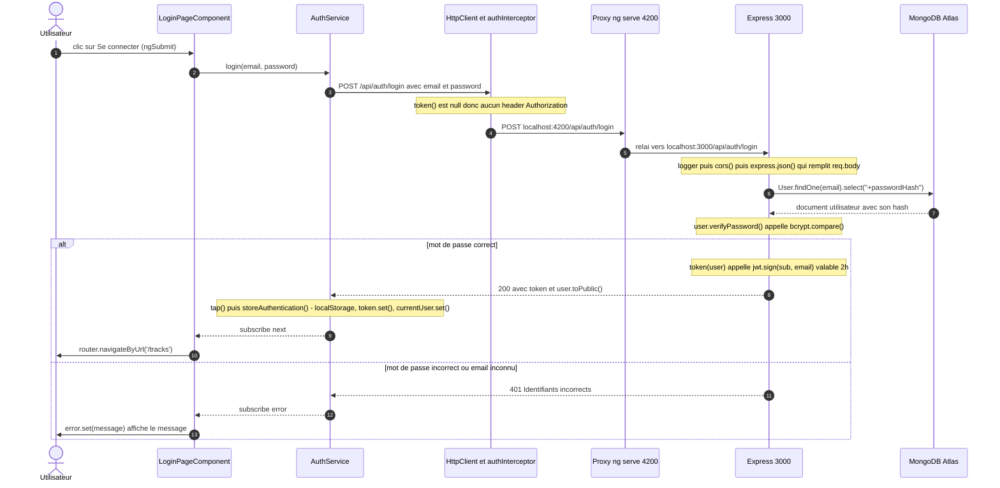

# Mission 0 — Cartographie de l'application

Objectif : comprendre l'architecture du portail Angular et de l'API Express
**sans modifier le code**, puis décrire le trajet d'un clic sur « Se connecter ».

Flux général étudié :

```text
composant Angular → service Angular → HttpClient → API Express → MongoDB
```

---

## 1. Les cinq éléments demandés par le sujet

| Élément | Où | Explication |
|---|---|---|
| **Composant racine** | [app.ts](frontend-starter/src/app/components/app/app.ts) — sélecteur `app-root` | Premier composant chargé. `index.html` contient la balise `<app-root>`, remplacée par son template : l'en-tête, la navigation et `<router-outlet />`, où s'affiche la page courante. |
| **Configuration des routes** | [routes.ts](frontend-starter/src/app/routes.ts) | Associe chaque URL à un composant. Enregistrée par `provideRouter(routes)` dans [main.ts:10](frontend-starter/src/main.ts#L10). |
| **Enregistrement de `HttpClient`** | [main.ts:11](frontend-starter/src/main.ts#L11) | `provideHttpClient(withInterceptors([authInterceptor]))`. Pas de `NgModule` : l'application est *standalone* et démarre avec `bootstrapApplication()`. |
| **Modèles, services et pages** | `shared/models/`, `shared/services/`, `components/` | Détail en section 2. |
| **Ajout du JWT aux requêtes** | [auth.interceptor.ts](frontend-starter/src/app/shared/interceptors/auth.interceptor.ts) | Fonction placée sur le trajet de **toutes** les requêtes. Si le signal `token()` est rempli, elle clone la requête (les requêtes Angular sont immuables) et ajoute `Authorization: Bearer <token>`. |

---

## 2. Modèles, services et pages

### Modèles — `frontend-starter/src/app/shared/models/`

Interfaces TypeScript qui recopient les formats du contrat HTTP. Elles n'existent
qu'à la compilation et vérifient qu'on utilise les bons champs.

| Fichier | Contenu | Correspond à |
|---|---|---|
| `user.model.ts` | `id, name, email, createdAt` | `User.toPublic()` côté backend |
| `auth-response.model.ts` | `token, user` | réponse de `register` et `login` |
| `track.model.ts` | `id, title, originalName, mimeType, size, createdAt` | `Track.toPublic()` côté backend |
| `page.model.ts` | `items, page, limit, total, pages` | réponse paginée de `GET /api/tracks` |

### Services — `frontend-starter/src/app/shared/services/`

Les **seules** classes qui utilisent `HttpClient`. `providedIn: 'root'` : une
instance unique partagée par toute l'application.

| Service | Méthode | Appel HTTP |
|---|---|---|
| [AuthService](frontend-starter/src/app/shared/services/auth.service.ts) | `login()` | `POST /api/auth/login` |
| | `register()` | `POST /api/auth/register` |
| | `profile()` | `GET /api/users/me` |
| | `update()` | `PUT /api/users/me` |
| | `logout()` | aucun (nettoyage local) |
| [TrackService](frontend-starter/src/app/shared/services/track.service.ts) | `list()` | `GET /api/tracks?page=&limit=` |
| | `upload()` | `POST /api/tracks` (multipart) |
| | `audio()` | `GET /api/tracks/:id/audio` (blob) |

`AuthService` contient aussi l'état de l'utilisateur, sous forme de deux signals :
`currentUser` (l'utilisateur connecté) et `token` (le JWT, initialisé depuis `localStorage`).

### Pages — `frontend-starter/src/app/components/`

| Composant | URL | Rôle |
|---|---|---|
| `AppComponent` | — | coquille : en-tête, navigation, `<router-outlet />` |
| `LoginPageComponent` | `/login` | formulaire réactif de connexion |
| `RegisterPageComponent` | `/register` | formulaire réactif d'inscription |
| `ProfilePageComponent` | `/profile` | lecture et modification du nom |
| `TracksPageComponent` | `/tracks` | upload, liste paginée, lecture audio |

Aucun composant n'importe `HttpClient` : tous passent par un service.

### Autres pièces d'infrastructure

| Fichier | Rôle |
|---|---|
| [auth.guard.ts](frontend-starter/src/app/shared/guards/auth.guard.ts) | Empêche l'accès à `/profile` et `/tracks` sans token ; redirige vers `/login`. Il ne vérifie que la **présence** du token, pas sa validité. |
| [proxy.conf.json](frontend-starter/proxy.conf.json) | En développement, `ng serve` relaie tout ce qui commence par `/api` de `localhost:4200` vers `localhost:3000`. Les services utilisent donc des URL relatives. |

---

## 3. Routes publiques et routes protégées

### Côté API (la vraie sécurité)

Une route est protégée quand le middleware `auth` ([app.js:56](backend/src/app.js#L56))
figure dans sa déclaration. Sans JWT valide, il répond `401` avant que le handler ne s'exécute.

| Méthode | Route | Accès | Déclaration |
|---|---|---|---|
| GET | `/api/health` | **publique** | [app.js:153](backend/src/app.js#L153) |
| POST | `/api/auth/register` | **publique** | [app.js:164](backend/src/app.js#L164) |
| POST | `/api/auth/login` | **publique** | [app.js:195](backend/src/app.js#L195) |
| GET | `/api/users/me` | protégée (JWT) | [app.js:229](backend/src/app.js#L229) |
| PUT | `/api/users/me` | protégée (JWT) | [app.js:249](backend/src/app.js#L249) |
| GET | `/api/tracks` | protégée (JWT) | [app.js:271](backend/src/app.js#L271) |
| POST | `/api/tracks` | protégée (JWT) | [app.js:334](backend/src/app.js#L334) |
| GET | `/api/tracks/:id/audio` | protégée (JWT) | [app.js:379](backend/src/app.js#L379) |
| DELETE | `/api/tracks/:id` | protégée (JWT) — bonus, non appelée par le front | [app.js:409](backend/src/app.js#L409) |

Règle du contrat : seules l'inscription et la connexion (plus le health check)
se passent de JWT. C'est logique : on ne peut pas exiger un token pour obtenir un token.

Les routes de pistes filtrent en plus par `ownerId: req.auth.sub` : un utilisateur
authentifié ne voit jamais les pistes d'un autre.

### Côté Angular (confort d'affichage uniquement)

| URL | Protection |
|---|---|
| `/login`, `/register` | publique |
| `/profile`, `/tracks` | `canActivate: [authGuard]` |

Le garde Angular n'est **pas** une mesure de sécurité : le code du navigateur est
modifiable par l'utilisateur. Il évite seulement d'afficher une page qui échouerait.
La protection réelle est le middleware `auth` du backend.

---

## 4. Schéma annoté du flux « Se connecter »



> Le diagramme s'affiche sur GitHub/GitLab et dans VS Code (extension
> « Markdown Preview Mermaid Support »). Pour une image, coller le bloc sur
> https://mermaid.live puis exporter en PNG.

### Annotations

| # | Étape | Fichier et ligne | Ce qu'il faut savoir expliquer |
|---|---|---|---|
| 1 | Clic | [login-page.html:3](frontend-starter/src/app/components/login-page/login-page.html#L3) | `(ngSubmit)` déclenche `submit()` à la soumission du formulaire. |
| 2 | Délégation | [login-page.ts:29](frontend-starter/src/app/components/login-page/login-page.ts#L29) | Le composant lit le formulaire avec `getRawValue()` et appelle le service. Il ne connaît pas HTTP. |
| 3 | Requête | [auth.service.ts:15](frontend-starter/src/app/shared/services/auth.service.ts#L15) | `http.post()` renvoie un Observable. La requête ne part qu'au `subscribe()` du composant. |
| — | Intercepteur | [auth.interceptor.ts:7](frontend-starter/src/app/shared/interceptors/auth.interceptor.ts#L7) | Au login, `token()` vaut normalement `null` : la requête passe sans header. |
| 4–5 | Proxy | [proxy.conf.json](frontend-starter/proxy.conf.json) | Le navigateur appelle le port 4200 ; `ng serve` relaie vers 3000. |
| — | Middlewares | [app.js:132-150](backend/src/app.js#L132) | Ordre : journalisation, CORS, lecture du JSON. Sans `express.json()`, `req.body` serait vide. |
| 6–7 | Recherche | [app.js:207](backend/src/app.js#L207) | `+passwordHash` est obligatoire : le champ est `select: false` dans le schéma. |
| — | Vérification | [app.js:209](backend/src/app.js#L209) et `verifyPassword()` dans [User.js](backend/src/models/User.js) | On ne compare jamais des mots de passe : bcrypt hache la saisie et compare les hashs. |
| — | Signature | [app.js:48](backend/src/app.js#L48) | Le JWT contient `sub` (id MongoDB) et `email`, signé avec `JWT_SECRET`, expire au bout de 2 h. |
| 8 | Réponse | [app.js:215](backend/src/app.js#L215) | `toPublic()` garantit que le hash ne sort pas du serveur. |
| — | Stockage | [auth.service.ts:45](frontend-starter/src/app/shared/services/auth.service.ts#L45) | `localStorage` pour survivre au rechargement, signals pour mettre l'écran à jour. |
| 9–10 | Redirection | [login-page.ts:32](frontend-starter/src/app/components/login-page/login-page.ts#L32) | Navigation sans rechargement de page. |
| 11–13 | Échec | [app.js:211](backend/src/app.js#L211) puis [login-page.ts:36](frontend-starter/src/app/components/login-page/login-page.ts#L36) | Le `tap()` n'est pas exécuté : rien n'est stocké. Le message du serveur est affiché. |

### Et juste après la connexion

L'arrivée sur `/tracks` enchaîne trois mécanismes :

1. `authGuard` lit `token()` : il est rempli, l'accès est accordé ;
2. le constructeur de `TracksPageComponent` appelle `load()`, donc `GET /api/tracks` ;
3. cette fois, `authInterceptor` trouve un token et ajoute `Authorization: Bearer …`.
   Le middleware `auth` du backend le vérifie avec `jwt.verify()` et place l'identité dans `req.auth`.

C'est le point à montrer dans l'onglet Network : la requête de login part **sans**
en-tête `Authorization`, la requête `/api/tracks` qui la suit part **avec**.

---

## 5. Question de la préparation : où sont les traces du backend ?

Dans le terminal où tourne `npm start` côté `backend/`. Chaque requête produit une ligne :

```text
[http] POST /api/auth/login -> 200 (84 ms)
```

Chaque étape métier a son préfixe : `[startup]`, `[auth]`, `[user]`, `[tracks]`,
`[multer]`, `[error]`. Les mots de passe et les JWT n'y apparaissent jamais :
le backend logue l'identifiant de l'utilisateur, pas ses secrets.

Côté frontend, les traces sont dans la **console** des DevTools (F12) : préfixes
`[LoginPage]`, `[ProfilePage]`, `[TracksPage]`.
